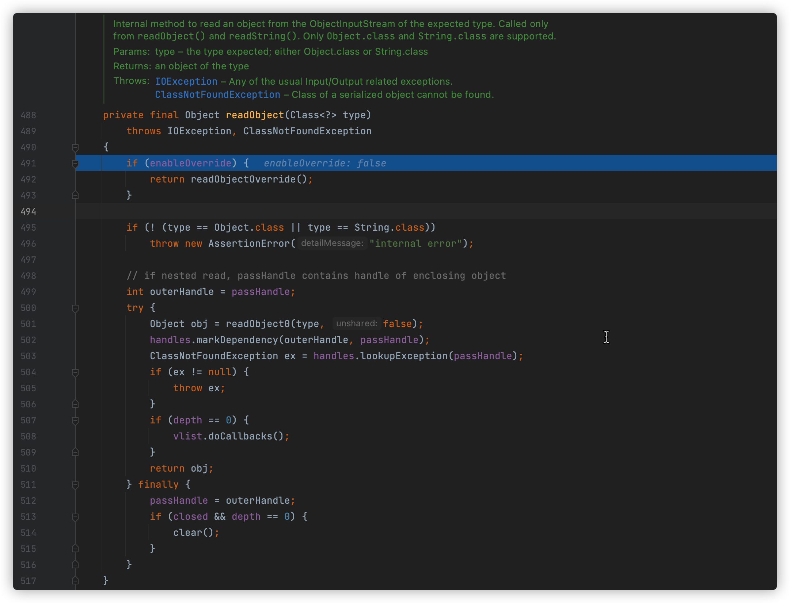

# 0x00 前言

目录：

[TOC]

本文的编写风格略有特殊。鄙人觉得这样编写显得逻辑更加清晰。欢迎师傅们提意见。

**序列化过程**主要涉及到三个方法的执行，callWrapped方法是主要方法，call和getObject方法均为其内部方法或内部方法的调用方法。~~这也是本文编写风格的一种体现，具体细节师傅们阅读即可了解。~~

**反序列化过程**，由于本人是新手，无法深入分析，给出具体的细节，仅写了调用栈的一个大致过程。

# 0x01 开始调试

在`ysoserial-master/src/main/java/ysoserial/payloads/URLDNS.java`文件的main函数下断点65行 执行PayloadRunner类的run方法。两个参数

- URLDNS.class获取URLDNS类的class对象；
- args为空。因为我们是直接调试的源码，并非命令行进行调用；

完整代码如下：

```java
public class PayloadRunner {

    public static void run(final Class<? extends ObjectPayload<?>> clazz, final String[] args) throws Exception {
		// ensure payload generation doesn't throw an exception
		byte[] serialized = new ExecCheckingSecurityManager().callWrapped(new Callable<byte[]>(){
			public byte[] call() throws Exception {
				final String command = args.length > 0 && args[0] != null ? args[0] : getDefaultTestCmd();

				System.out.println("generating payload object(s) for command: '" + command + "'");

				ObjectPayload<?> payload = clazz.newInstance();
                final Object objBefore = payload.getObject(command);

				System.out.println("serializing payload");
				byte[] ser = Serializer.serialize(objBefore);
				Utils.releasePayload(payload, objBefore);
                return ser;
		}});

		try {
			System.out.println("deserializing payload");
			final Object objAfter = Deserializer.deserialize(serialized);
		} catch (Exception e) {
			e.printStackTrace();
		}

	}
```

# 0x02 序列化

URLDNS gadget chain中序列化字符串由run方法调用callWrapped方法执行获得。

## **分析run方法**


`final class<? extends ObjectPayload<?>> clazz`表示clazz的可被赋值类型限定为ObjectPayload<?>，且不可改变。

> OBjectPayload<?>中的?是通配符，可代表任意类，减少代码量。如下：
>
> 使用泛型T
>
> ```java
> Point<Integer> integerPoint = new Point<Integer>(3,3);   
> Point<Float> floatPoint = new Point<Float>(4.3f,4.3f);  
> Point<Double> doublePoint = new Point<Double>(4.3d,4.90d);  
> Point<Long> longPoint = new Point<Long>(12l,23l); 
> ```
>
> 使用通配符?
>
> ```java
> Point<?> point;  
>   
> point = new Point<Integer>(3,3);  
> point = new Point<Float>(4.3f,4.3f);  
> point = new Point<Double>(4.3d,4.90d);  
> point = new Point<Long>(12l,23l);  
> ```
>
> 其对比见文章：https://blog.csdn.net/qq_27093465/article/details/73249434

`final String[] args`表示args的数据类型为`String[]`

## **分析CallWrapped方法**


`new Callable<byte[]>(){public...call().....}`重新定义了Callable接口的call方法，并将其自身作为参数传入ExecCheckingSecurityManager类的callWrapped方法。

对程序下断点调试，程序进入run方法后，首先调用的是callWrapped方法，这也是获取反序列化字符串的方法。

## 执行callWrapped方法


69-70行 进行了安全配置，设置SecurityManager为ExecCheckingSecurityManager

> 当运行未知的Java程序的时候，该程序可能有恶意代码（删除系统文件、重启系统等），为了防止运行恶意代码对系统产生影响，需要对运行的代码的权限进行控制，这时候就要启用Java安全管理器。

72行 执行了callable（也就是传入的`new Callable<byte[]>(){}`实例）的call方法。

------

**见下文执行call方法**

------

73-75行 进行了一个判断，推测是判断是否存在执行的命令，并不知道其具体想要判断的内容是什么。

84行 由于try-catch-finally语法，执行`setSecurityManager(sm)`，不知道什么用。

76行 返回result，也就是call方法获取的序列化字符串。

~~**callWrapped方法执行完毕，得到的Hashmap对象的序列化字符串赋值给了变量serialized。下一节本文将阐述URLDNS gadget chain的反序列化过程**。~~

## 执行call方法

23行 获取用户想要执行的命令。查看getDefaultTestCmd方法的逻辑，如图，调用了GetFirstExistingFile方法，传入参数为计算器的可执行文件列表。由于本文想要进行的是DNS探测，所以这里我设置了返回值为`http://22ervmop.ns.dns3.cf`。

25行 打印`generating payload..............`

27行 获取clazz（class ysoserial.payloads.URLDNS）的实例化对象。我们可以看到其使用了通配符`?`，赋值类型为`ObjectPayload<?>`，这印证了上文所述run方法参数限定的`...extends ObjectPayload<?>...`

28行 调用URLDNS类的getObject方法，结果赋值给objBefore参数。

------

**见下文执行getObject方法**

------

30行 打印`serializing payload`

31行 调用Serializer类的serialize方法序列化变量objBefore。objBefore变量的值为URLDNS的getObject方法返回的值，也就是一个HashMap对象

> 需要注意的是，Serializer类内存在两个serialize方法，注意区分。

32行 执行Utils类的releasPayload方法，直接退出了执行，不知道有什么用。

33行 返回变了ser，也就是序列化后的byte字符串。

~~**call方法执行完毕，返回callWrapped方法**~~

## 执行getObject方法


53行 实例化SilentURLStreamHandler类，并赋值给handler。SilentURLStreamHandler类继承URLStreamHandler，是URLDNS的内部类。其作用在源码中给了注释：This instance of URLStreamHandler is used to avoid any DNS resolution while creating the URL instance.

55行 实例化HashMap类，并赋值给ht。HashMap 继承于AbstractMap，实现了 Map、Cloneable、java.io.Serializable 接口。

56行 实例化URL类，初始化url和handler，并赋值给u。

57行 将键为`url的class对象`，值为`url`的数据put进变量ht中。这里的是执行DNS探测的核心代码，也就是执行put方法触发getHostAddress方法（执行进行dns探测的方法）。其调用栈如下：

```java
getHostAddress:84, URLDNS$SilentURLStreamHandler (ysoserial.payloads)
hashCode:359, URLStreamHandler (java.net)
hashCode:902, URL (java.net)
hash:339, HashMap (java.util)
put:612, HashMap (java.util)
getObject:57, URLDNS (ysoserial.payloads)
call:28, PayloadRunner$1 (ysoserial.payloads.util)
call:21, PayloadRunner$1 (ysoserial.payloads.util)
callWrapped:72, ExecCheckingSecurityManager (ysoserial.secmgr)
run:21, PayloadRunner (ysoserial.payloads.util)
main:65, URLDNS (ysoserial.payloads)
```

------

**见下文hashcode调用栈分析**

------

59行 执行Reflections类的setFieldValue方法。该方法先调用getField方法获取URL类的私有属性hashcode的访问权限，然后调用set方法设置hashcode的值为-1。

61行 返回变量ht，也就是上文处理过的Hashmap对象（这是要进行序列化的对象）。

> 在上图45行参数u的hashcode的值被设置成了-1，这同样会影响到**返回变量ht中键值u的hashcode值**。

~~**getObject方法执行完毕，回到上文执行call方法**~~

## hashcode调用栈分析

```java
getHostAddress:84, URLDNS$SilentURLStreamHandler (ysoserial.payloads)
hashCode:359, URLStreamHandler (java.net)
hashCode:902, URL (java.net)
hash:339, HashMap (java.util)
put:612, HashMap (java.util)
getObject:57, URLDNS (ysoserial.payloads)
call:28, PayloadRunner$1 (ysoserial.payloads.util)
call:21, PayloadRunner$1 (ysoserial.payloads.util)
callWrapped:72, ExecCheckingSecurityManager (ysoserial.secmgr)
run:21, PayloadRunner (ysoserial.payloads.util)
main:65, URLDNS (ysoserial.payloads)
```

第3行 hashcode:URL 调用hashcode:URLStreamHandler。源码如图：

这里的handler是`URLDNS$SilentURLStreamHandler`，也就是URLDNS类的内部类SilentURLStreamHandler，其继承了URLStreamHandler，所以会调用URLStreamHandler的hashcode方法。

第2行 hashcode:URLStreamHandler 方法会调用 SilentURLStreamHandler类的getHostAddress方法。但是此处并不会触发DNS探测活动，这是因为，URLDNS类的内部类SilentURLStreamHandler重写了URLStreamHandler类的getHostAddress方法。具体见**执行getObject方法**的53行和**URLDNS源码**

~~**调用栈分析完毕，回到上文执行getObject方法**~~

# 0x02 反序列化

在序列化过程结束后，序列化字符串赋值给了变量serialized。在反序列化过程中（集中在run方法的`try-catch`代码块），将调用Deserializer的deserialize方法反序列化变量serialized。

37行 打印`deserializing payload`

38行 调用deserialize方法进行反序列化。该方法将调用ObjectInputStream内部类的readObject方法。

> Deserializer类的deserialize方法同样有两个。
>
> 触发反序列化的关键代码在27行的readObject方法，该方法是java的内部类ObjectInputStream的方法。command+鼠标左键点击readObject方法，进入ObjectInputStream类内部，在459行下断点。如图
>
> 跟进分析，执行readObject(Class<?> type)方法

------

~~**见下文执行readObject方法**~~

------

## 执行readObject方法

~~下述代码涉及到反序列化底层的实现和调用过程，实力原因，无法详细分析~~

在Deserializer类的deserialize(final InputStream in )方法中，有如下代码

```java
return objIn.readObject()
```

该代码将调用内部类ObjectInputStream的无参readObject方法->有参readObject方法。接下来，本文将分析该有参readObject方法的执行过程，这也是反序列化过程的关键代码。代码如图：

501行 执行readObject0方法。readObject0是readObject方法的底层实现。在readObject0方法中，由于反序列化的对象是Hashmap，一个Object，程序将调用readOrdinaryObject方法。（以下列出关键代码的调用）
`readObject0(type, false)->readOrdinaryObject(unshared)``readOrdinaryObject(unshared)->readSerialData(obj, desc)``readSerialData(obj, desc)->invokeReadObject(obj, this)``invokeReadObject(obj, this)->invoke(obj, new Object[]{ in })``HashMap.readObject(....)->putVal(hash(key),key,value,false, false)``putVal(hash(key),key,value,false, false)->hash(key)``HashMap.hash(key)->URL.hashCode()``URL.hashCode()->URLStreamHandler.hashCode(this)``URLStreamHandler.hashCode(this)->getHostAddress(u)`getHostAddress方法的定义为

> Get the IP address of our host. An empty host field or a DNS failure will result in a null return.

也就是触发DNS查询的关键方法。上述调用栈如下：

```java
getHostAddress:434, URLStreamHandler (java.net)
hashCode:359, URLStreamHandler (java.net)
hashCode:902, URL (java.net)
hash:339, HashMap (java.util)
readObject:1413, HashMap (java.util)
invoke0:-1, NativeMethodAccessorImpl (sun.reflect)
invoke:62, NativeMethodAccessorImpl (sun.reflect)
invoke:43, DelegatingMethodAccessorImpl (sun.reflect)
invoke:498, Method (java.lang.reflect)
invokeReadObject:1185, ObjectStreamClass (java.io)
readSerialData:2294, ObjectInputStream (java.io)
readOrdinaryObject:2185, ObjectInputStream (java.io)
readObject0:1665, ObjectInputStream (java.io)
readObject:501, ObjectInputStream (java.io)
readObject:459, ObjectInputStream (java.io)
deserialize:27, Deserializer (ysoserial)
deserialize:22, Deserializer (ysoserial)
run:38, PayloadRunner (ysoserial.payloads.util)
main:65, URLDNS (ysoserial.payloads)
```

> 6-9行为invoke方法的内部实现调用。建议不看

从整个过程来看，详细分析该过程主要有以下几个难点：

- Java反序列化的过程涉及到很多内部类，比较复杂和难懂。如：Java反序列化底层实现的过程分析；内部类Method的invoke方法的实现分析；HashMap类的内部实现分析。当然，这些代码只需要跟进关键方法也可以理解大概的过程。但是我还是想弄懂（tnnd
- Java开发的一些概念，较为晦涩难懂。

# 0x03 总结

URLDNS的gadget chains确实比较简单，整个过程并未涉及到反射等相关知识。可概括如下：反序列化进入HashMap的readObject，触发key（也就是URL类对象）的hashCode方法，在hashCode方法中调用getHostAddress方法，进行DNS查询。