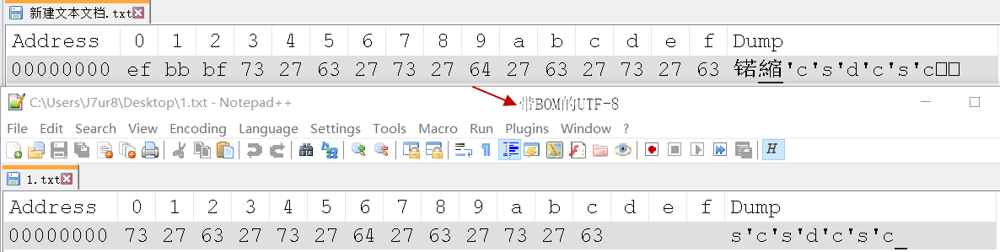

# 编码

## 基础问题

1. [带BOM的UTF-8和无BOM的UTF-8](https://www.zhihu.com/question/20167122)

   

2. [全角和半角](https://www.zhihu.com/question/19605819)

3. [ASCII、UTF-8和Unicode的关系](http://www.ruanyifeng.com/blog/2007/10/ascii_unicode_and_utf-8.html)

4. [字符集和字符编码](http://cenalulu.github.io/linux/character-encoding/#toc5)

unicode是一个包含全世界字符的字符集；utf8、gbk都是字符编码，utf8是unicode的一种实现方式。

## 不同语言中的编码

- PHP
- Python

## 参考

- https://www.ituring.com.cn/article/1115
- http://www.ruanyifeng.com/blog/2007/10/ascii_unicode_and_utf-8.html

- [https://zh.wikipedia.org/wiki/%E6%B1%89%E5%AD%97%E5%86%85%E7%A0%81%E6%89%A9%E5%B1%95%E8%A7%84%E8%8C%83](https://zh.wikipedia.org/wiki/汉字内码扩展规范)

- https://unicode-table.com/cn/#specials

- https://tools.ietf.org/html/rfc3629