# 通配符

## 通配符符号

如果一个字符串包含`?`、`*`、`[`三种符号中的一个，这个字符串就会被认为是一个通配符模式的字符串。

## 常规匹配

一个`?`会匹配任意一个字符。但是`?`不能在括号之间，这里的括号指的是中括号，因为小括号在shell下有意义，转义之后使用没什么问题；中括号在通配符模式下有意义，使得`?`只代表其本身；而大括号有点特殊（后面会说

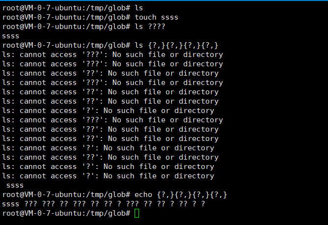

一个`*`会匹配任一字符串，包括空格。但是`*`不能在括号之间（同上），而大括号同样有点特殊。

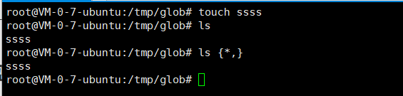

## 中括号的2种匹配模式

通配符支持使用`[xxx]`来指定匹配在`xxx`所指定的一个字符集中的字符，`xxx`代表`[`和`]`之间的内容。下面是几种对`[]`的使用

### 范围

两个被`-`隔开的字符确定一个范围集，如`[A-Fa-f0-9]`等同于`[ABCDEFabcdef0123456789]`。表达式将匹配一个属于范围集内的字符。

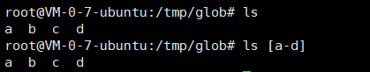

### 排除

表达式`[!...]`匹配一个不被表达式包含的字符。如`[!a-c]`匹配任何一个不是`abc`的字符。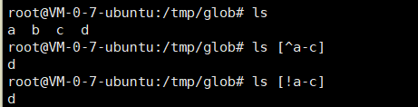

除了`!`之外正则表达式的`^`符号也可以用来表示排除，但是linux的文档中写到

> ```
> POSIX has declared the effect of a wildcard pattern "[^...]" to be undefined.
> ```


## 注意

### 中括号的特殊性

在中括号的内容中，除了一些特殊符号的特殊用法，其表现含义均为其本身。所以一些在其他环境下有意义的符号，其是并无意义。如：

```bash
ls [a+b+c+d]
```

意思就是匹配`abcd+`，加号并没有起到连接之类的作用。

再如`ls a[,]`中，逗号的含义也仅仅是匹配`,`。

### 括号中的内容不为空

`[]`不允许其中间的内容为空。举个例子：

```
ls [][!]
```

以上会匹配`]`、`[`和`!`中字符。如下：

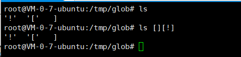

需要匹配`]`符号，最好将其放在一个字符集，如`[ -_]`；或者将其放在第一位，如`[]]`。

### 通配符符号将表现其本身含义

符号`*`、`?`、`\`、 `[`和`]`在`[]`中会失去其特殊意义，只代表其本身。

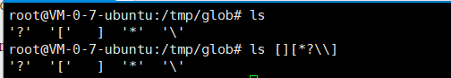

### 通配符不匹配路径

任何情况下，通配符表达式都不会匹配`/`。可能是怕其和路径符号`/`冲突，而且在Linux中也无法建立名为`/`的文件或文件夹。

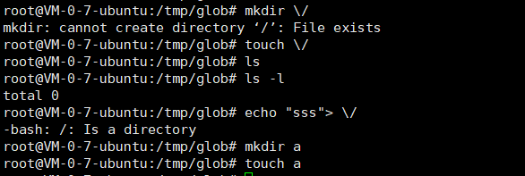

### 语法错误和文件不存在

如果文件不存在或者语法错误，那么字符串将表现为其本身含义。如下

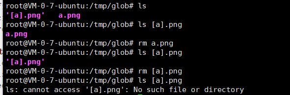

对于语法错误和匹配的文件不存在的情况，也不会展开表达式，直接表现为其本身。这和花括号的匹配模式有所差别，详情看`花括号`

## 通配符集表达式

### 表达式

| 字符集合元素   | 描述                                                         | 示例                                                         |
| -------------- | ------------------------------------------------------------ | ------------------------------------------------------------ |
| [.*比较符号*.] | [..] 括号允许指定一个不包含单一字符的比较符号。例如 [.ch.]。如果在 [..] 括号中的字符串是无效的比较字符，将认为表达式无效。 | `[[.ch.]]+c`匹配字符串 "chchc" 但不是 "hc" 或 "cc"。`[[.qx.]] `是一个无效的表达式。 |
| [=*等价类*=]   | [= =] 括号允许指定字符等价类。一个字符的等价类包含所有匹配的字符，不考虑于大小写、变音和溢音等等。 | `[[=a=]]`匹配 'a'、'A'、'A' 和其它 A 字符。                  |
| [:*字符类*:]   | [::] 括号允许指定一整类字符。有效的字符类就是对应于执行策略的语言环境的 LC_CTYPE 种类的那些字符。 | `[[:digit:]]`匹配任何数字。`[[:lower:]] `匹配 C 语言环境中的 [a-z]，但是将有可能包含法国语言环境中的字符，例如变音符号（¸)。 |

#### 等价类

对于`[[=a=]]`，再`man7.org`中说是会匹配等价于`[aáàäâ]`，而在上文`ibm.com`的表单中说为匹配`aA`等其他A字符。但其受限于`当前环境的等价类`并不总是匹配`a`及`A`、`aáàäâ`字符

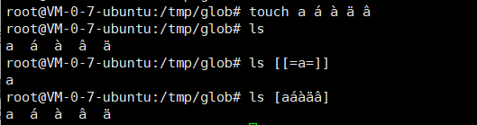

#### 字符类

POSIX归纳了一些通配符集字符类，以方便不同地区（语言不同）便以使用

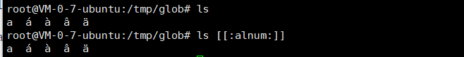

更多的定义见下表

### 通配符集字符类

对所有语言环境有效的通配符集字符类

| 字符类     | 描述                   | 示例                                                         |
| ---------- | ---------------------- | ------------------------------------------------------------ |
| [:alnum:]  | 字母字符和十进制数字   | 'a', 'A', '6'                                                |
| [:alpha:]  | 字母字符               | 'a', 'A', 'Z'                                                |
| [:blank:]  | 空白字符               | 空格、制表符、换行符                                         |
| [:cntrl:]  | ASCII 控制字符         | '^A','^C'                                                    |
| [:digit:]  | 十进制数字             | '0', '1', '2', '3'                                           |
| [:graph:]  | 图形字符               |                                                              |
| [:lower:]  | 小写字符字符           | 'a', 'b', 'c'                                                |
| [:print:]  | 可打印字符             | 任何匹配 [:alnum:]、[:graph:]、[:punct:] 或者空格字符并且不匹配 [:cntrl:] |
| [:punct:]  | 标点字符               | ',', '"'                                                     |
| [:space:]  | 空白字符：空格和制表符 | 空格，制表符                                                 |
| [:upper:]  | 大写字母字符           | 'A', 'B', 'C'                                                |
| [:xdigit:] | 十六进制数字           | '0', '3', 'A', 'f'                                           |

## 花括号

并没有在通配符的官方文档中看到有关于花括号的解释，不过可能是我没有搜到。

对于花括号，有以下几点

- 使用逗号分隔
- 可组合可嵌套
- 通配符符号不会失去其特殊意义
- 文件不存在依然会展开其将匹配的模式

### 使用逗号分隔

`{a,b}`代表匹配字符`a`和`b`，`a`和`b`都会去尝试匹配，且如果不存在会报错。

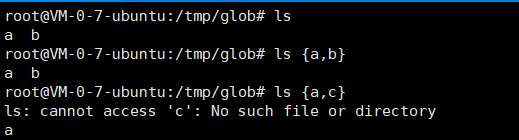

如果只想匹配一个字符，不可使用`{a}`，同样需要逗号`{a,}`

### 可嵌套可组合

组合匹配，发现其有一定规律

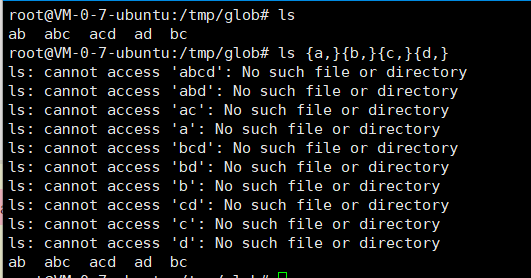

嵌套匹配

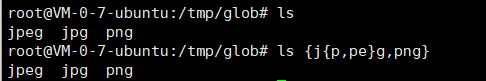

### 通配符符号有意义

通配符符号再花括号下不会失去其特殊意义

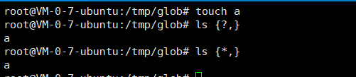

### 总会展开其将匹配的模式

文件不存在依然会展开其将匹配的模式


# 参考

- http://man7.org/linux/man-pages/man7/glob.7.html
- http://www.ruanyifeng.com/blog/2018/09/bash-wildcards.html

- http://publib.boulder.ibm.com/tividd/td/ITAMOS/SC23-4827-01/zh_CN/HTML/admin297.htm#finalep