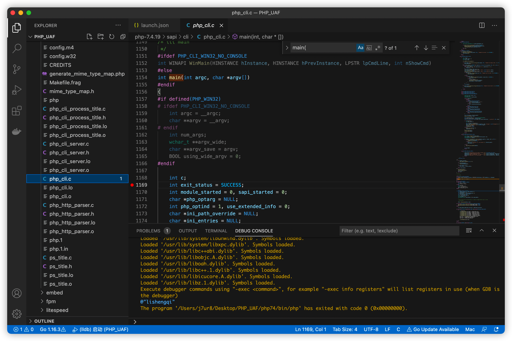
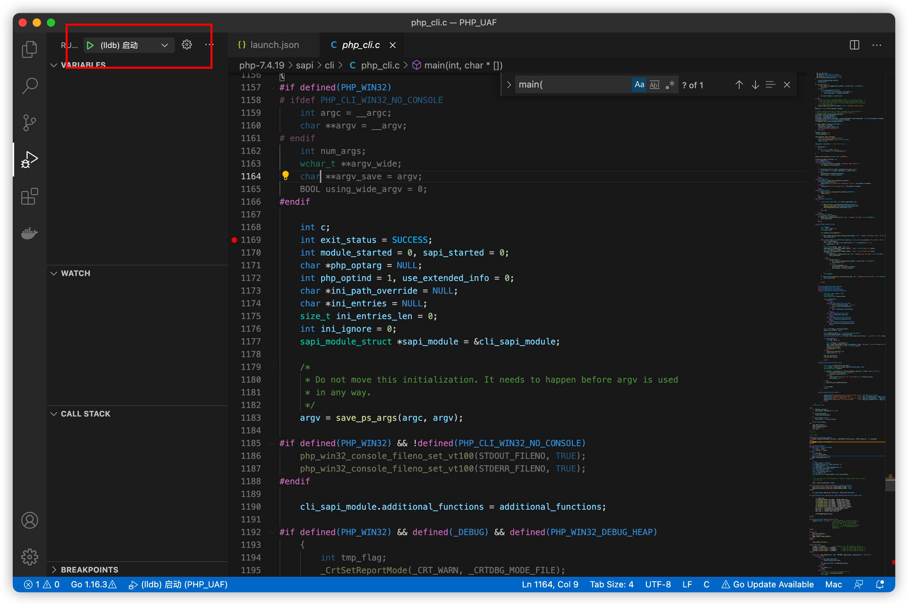
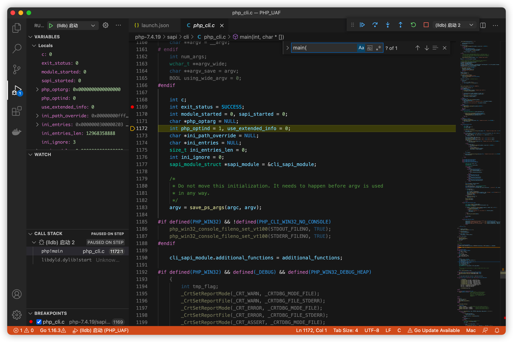

# M1下VScode调试php源码

## 前言

​		使用VScode调试php源码需要先安装c/c++扩展，并配置launch.json等文件。由于VScode的c/c++扩展尚未支持Apple silicon M1芯片，所以我们需要编译安装x86_64版本的php，适用M1在x86_64运行环境下调试php源码。

主要有以下几个步骤：

一、**安装x86_64版本的php：**

1. 源码编译安装x86_64版本的libiconv
2. 源码编译安装x86_64版本的php

二、**配置VScode**

1. 安装c/c++扩展
2. 配置launch.json

## 安装x86_64版本的php

​		安装x86_64版本的php我们需要用到以下命令，xxxxxxxxxxxx处为执行的命令。

```bash
arch -x86_64 xxxxxxxx
```

### 源码编译安装x86_64版本的libiconv

​		从[官网](https://ftp.gnu.org/gnu/libiconv/)下载libiconv源码，解压后，进入目录执行以下命令即可安装成功。

```bash
arch -x86_64 ./configure --prefix=/Users/x x x x/Documents/bin/libiconv  #指定的安装目录
arch -x86_64 make
arch -x86_64 make install
```

### 源码编译安装x86_64版本的php

​		从[官网](https://www.php.net/distributions/php-7.4.19.tar.gz)下载php7.4源码，解压后，进入目录执行以下命令即可安装成功。

```bash
arch -x86_64 ./buildconf --force
arch -x86_64 --prefix=/Users/xxx/Desktop/PHP_UAF/php74 --exec-prefix=/Users/xxx/Desktop/PHP_UAF/php74 --enable-fpm --enable-debug --with-iconv=/Users/xxx/Documents/bin/libiconv --without-pear --disable-phar
# 注意这里 --with-iconv参数的值要与上文所述中安装的libiconv目录对应。
```

安装完x86_64版本的php后，只需要配置好VScode即可调试源码了。

## 配置VScode

​		这是我电脑上深度为1的目录树：

```
PHP_UAF
├── php-7.4.19
├── php74
└── test.php
```

​		三个文件均位于PHP_UAF文件夹下。php-7.4.19是源代码文件夹；php74是编译安装php-7.4.19源码后产生的x86_64版本php文件夹；test.php是调试源码的入口文件。

​		使用VScode打开PHP_UAF文件夹，新建.vscode文件夹，创建.vscode/launch.json文件。目录树如下：

```
├── .vscode
│   └── launch.json
├── php-7.4.19
│   ├── .appveyor.yml
│   ├── .editorconfig
│   ├── ...
│   ├── ...
│   └── win32
├── php74
│   ├── bin
│   ├── etc
│   ├── include
│   ├── lib
│   ├── php
│   ├── sbin
│   └── var
└── test.php
```

### 安装c/c++扩展

​		属于基本操作，百度即可。

### 配置launch.json

​		由于我并未进一步了解launch.json方面的相关知识，直接使用谷歌搜索后复制粘贴进行使用，所以直接给出launch.json的代码内容：

```json
{
    // Use IntelliSense to learn about possible attributes.
    // Hover to view descriptions of existing attributes.
    // For more information, visit: https://go.microsoft.com/fwlink/?linkid=830387
    "version": "0.2.0",
    "configurations": [
        {
            "name": "(lldb) 启动",
            "type": "cppdbg",
            "request": "launch",
            "program": "/Users/xxx/Desktop/PHP_UAF/php74/bin/php",
            "args": [
                "-f", "/Users/xxx/Desktop/PHP_UAF/test.php"
            ],
            "stopAtEntry": false,
            // "targetArchitecture": "arm64",
            "cwd": "${workspaceFolder}",
            "environment": [],
            "externalConsole": false,
            "MIMode": "lldb"
        }
    ]
}
```

​		更改program及args为自己的目录路径。program为编译的x86_64版本php可执行文件路径；args为上文所述的调试源码的入口文件。

## 调试

​		在`/Users/xxx/Desktop/PHP_UAF/php-7.4.19/sapi/cli/php_cli.c`文件的main函数下断点。



​		开始debug



​		断点捕获成功



# 安装gd扩展

```bash
cd /Users/j7ur8/Desktop/PHP_UAF/php-7.4.19/ext/gd
arch -x86_64 /Users/j7ur8/Desktop/PHP_UAF/php74/bin/phpize

arch -x86_64 ./configure --with-php-config=/Users/j7ur8/Desktop/PHP_UAF/php74/bin/php-config CC="gcc -arch x86_64"  CC="gcc -arch x86_64"
arch -x86_64 make
arch -x86_64 make install

```

