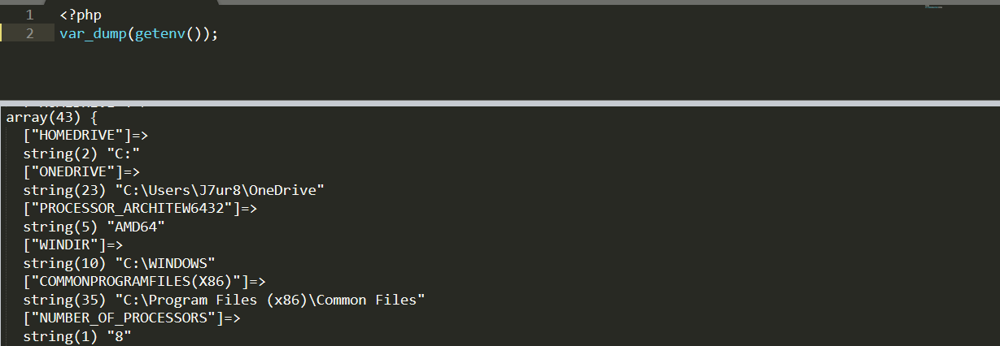

# PHP7.1函数相关变更

## list()现在支持键名

现在`list()`和它的新的*[]*语法支持在它内部去指定键名。这意味着它可以将任意类型的数组 都赋值给一些变量（与短数组语法类似）

```php
<?php
$data = [
    ["id" => 1, "name" => 'Tom'],
    ["id" => 2, "name" => 'Fred'],
];

// list() style
list("id" => $id1, "name" => $name1) = $data[0];

// [] style
["id" => $id1, "name" => $name1] = $data[0];

// list() style
foreach ($data as list("id" => $id, "name" => $name)) {
    // logic here with $id and $name
}

// [] style
foreach ($data as ["id" => $id, "name" => $name]) {
    // logic here with $id and $name
}
```

## 禁止动态调用的函数

如下：

- [assert()](https://www.php.net/manual/zh/function.assert.php) - with a string as the first argument
- [compact()](https://www.php.net/manual/zh/function.compact.php)
- [extract()](https://www.php.net/manual/zh/function.extract.php)
- [func_get_args()](https://www.php.net/manual/zh/function.func-get-args.php)
- [func_get_arg()](https://www.php.net/manual/zh/function.func-get-arg.php)
- [func_num_args()](https://www.php.net/manual/zh/function.func-num-args.php)
- [get_defined_vars()](https://www.php.net/manual/zh/function.get-defined-vars.php)
- [mb_parse_str()](https://www.php.net/manual/zh/function.mb-parse-str.php) - with one arg
- [parse_str()](https://www.php.net/manual/zh/function.parse-str.php) - with one arg

尾随的`-`代表禁止动态调用的条件。`func_get_args`等几个函数测试了下好像并没有禁止动态调用？不太懂。

## unserialize

对`allowed_classes`参数严格化，如果对其传入的值是**布尔值**和**数组**之外的内容，`unserialize`将返回**False**和**E_WARNING**

## getenv可以不需要传入参数

`getenv()` 可以不传入任何参数。 如果不传入参数，此函数会以关联数组的形式 返回所有的环境变量。



## parse_url支持RFC3986

`parse_url()` 更加严格的限制， 并且提供对 RFC3986 的支持。

## session_start将返回false

`session_start()` 当无法成功初始化会话的时候，返回 **FALSE**， 并且不会初始化超级变量 `$_SESSION`。

但是我测试的时候发现，PHP7.0已经会返回False了（Win+PHP7.12nts

```php
<?php
@var_dump(session_start('11'));
@var_dump($_SESSION);

# 结果
/*
php5
bool(true)
array(0) {
}

PHP5
bool(false)
NULL
```

## （废弃）两个函数的Eval选项

[mb_ereg_replace()](https://www.php.net/manual/zh/function.mb-ereg-replace.php)和[mb_eregi_replace()](https://www.php.net/manual/zh/function.mb-eregi-replace.php)

## （废弃）ext/mcrypt

# PHP7.1语法相关的变更

## (增加）短数组

短数组语法`[]`现在作为`list()`语法的一个备选项，可以用于将数组的值赋给一些变量（包括在*foreach*中）。

```php
<?php
$data = [
    [1, 'Tom'],
    [2, 'Fred'],
];

var_dump($data);

// list() style

list($id1, $name1) = $data[0];

// [] style
#[$id1, $name1] = $data[0];

// list() style
foreach ($data as list($id, $name)) {
	echo "$id $name\n";
    // logic here with $id and $name
}

// [] style
foreach ($data as [$id, $name]) {
    // logic here with $id and $name
}
```

## （增加）支持为负的字符串偏移量

现在所有支持偏移量的[字符串操作函数](https://www.php.net/manual/zh/book.strings.php) 都支持接受负数作为偏移量，包括通过`[]`或`{}`操作[字符串下标](https://www.php.net/manual/zh/language.types.string.php#language.types.string.substr)。在这种情况下，一个负数的偏移量会被理解为一个从字符串结尾开始的偏移量。

```php
<?php
var_dump("abcdef"[-2]); // string (1) "e"
var_dump(strpos("aabbcc", "b", -3));  // int(3)
```

字符串也同样支持

```php
<?php
$string = 'bar';
echo "The last character of '$string' is '$string[-1]'.\n";

# 结果
/*
The last character of 'bar' is 'r'.
*/
```

## （增加）当传递参数过少时将抛出错误

在过去如果我们调用一个用户定义的函数时，提供的参数不足，那么将会产生一个警告(warning)。 现在，这个警告被提升为一个错误异常(Error exception)，意味着PHP会中断执行。这个变更仅对用户定义的函数生效， 并不包含内置函数。例如：

```php
<?php
function test($param){
	echo "1\n";
}
system();
test();
```


## 引用数组元素创建元素的顺序更改

```
<?php
$array = [];
$array["a"] =& $array["b"];
$array["b"] = 1;
var_dump($array);

# 结果
/*
PHP7.0
array(2) {
  ["a"]=>
  &int(1)
  ["b"]=>
  &int(1)
}

PHP7.1
array(2) {
  ["b"]=>
  &int(1)
  ["a"]=>
  &int(1)
}
*/
```

## JSON编码和解码

解码一个空键值将会解析为一个空属性名，而之前会解析为`_empty_`

```php
<?php
var_dump(json_decode(json_encode(['' => 1])));

# 结果
/*
PHP<7.1
object(stdClass)#1 (1) {
  ["_empty_"]=>
  int(1)
}

PHP7.1
object(stdClass)#1 (1) {
  [""]=>
  int(1)
}
```

# 杂项

## 可为空（Nullable）类型[ ¶](https://www.php.net/manual/zh/migration71.new-features.php#migration71.new-features.nullable-types)

## Void 函数[ ¶](https://www.php.net/manual/zh/migration71.new-features.php#migration71.new-features.void-functions)

## 类常量可见性[ ¶](https://www.php.net/manual/zh/migration71.new-features.php#migration71.new-features.class-constant-visibility)

## [iterable](https://www.php.net/manual/zh/language.types.iterable.php) 伪类[ ¶](https://www.php.net/manual/zh/migration71.new-features.php#migration71.new-features.iterable-pseudo-type)

## 多异常捕获处理[ ¶](https://www.php.net/manual/zh/migration71.new-features.php#migration71.new-features.mulit-catch-exception-handling)

## Invalid class, interface, and trait names[ ¶](https://www.php.net/manual/zh/migration71.incompatible.php#migration71.incompatible.invalid-class-names)

## Numerical string conversions now respect scientific notation[ ¶](https://www.php.net/manual/zh/migration71.incompatible.php#migration71.incompatible.numerical-strings-scientific-notation)

## Fixes to [mt_rand()](https://www.php.net/manual/zh/function.mt-rand.php) algorithm[ ¶](https://www.php.net/manual/zh/migration71.incompatible.php#migration71.incompatible.fixes-to-mt_rand-algorithm)

## [rand()](https://www.php.net/manual/zh/function.rand.php) aliased to [mt_rand()](https://www.php.net/manual/zh/function.mt-rand.php) and [srand()](https://www.php.net/manual/zh/function.srand.php) aliased to [mt_srand()](https://www.php.net/manual/zh/function.mt-srand.php) [¶](https://www.php.net/manual/zh/migration71.incompatible.php#migration71.incompatible.rand-srand-aliases)

## Disallow the ASCII delete control character in identifiers[ ¶](https://www.php.net/manual/zh/migration71.incompatible.php#migration71.incompatible.delete-control-character-in-identifiers)

## 在不完整的对象上不再调用析构方法[ ¶](https://www.php.net/manual/zh/migration71.incompatible.php#migration71.incompatible.dont-call-destructors)

## [call_user_func()](https://www.php.net/manual/zh/function.call-user-func.php)不再支持对传址的函数的调用 [¶](https://www.php.net/manual/zh/migration71.incompatible.php#migration71.incompatible.call_user_func-with-ref-args)

## ini配置项移除[ ¶](https://www.php.net/manual/zh/migration71.incompatible.php#migration71.incompatible.removed-ini-directives)

## Sort order of equal elements

## Lexically bound variables cannot reuse names[ ¶](https://www.php.net/manual/zh/migration71.incompatible.php#migration71.incompatible.lexical-names)

