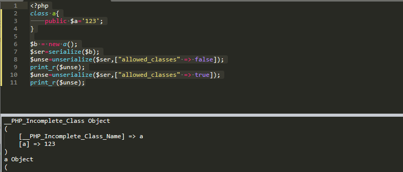
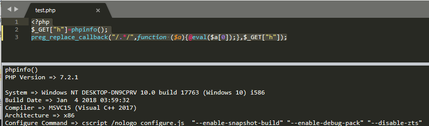

# 函数变更

## 变更的函数

### 关于list处理方式的变更

#### list不再以反向的顺序来进行赋值

`list`现在会按照变量定义的顺序来给他们进行赋值，而非反过来的顺序。 通常来说，这只会影响`list`与数组的`[]`操作符一起使用的案例，如下所示：

```php
<?php
list($a[], $a[], $a[]) = [1, 2, 3];
var_dump($a);
?>
```

```php
PHP5
array(3) {
  [0]=>
  int(3)
  [1]=>
  int(2)
  [2]=>
  int(1)
}

PHP7
array(3) {
  [0]=>
  int(1)
  [1]=>
  int(2)
  [2]=>
  int(3)
}
```

推荐不要依赖l`ist`的赋值顺序，因为这是一个在未来也许会变更的实现细节。

#### list 结构现在不再能是空的

list结构现在不再能是空的。如下的例子不再被允许：

```php
<?php
var_dump(list() = $a);
var_dump(list(,,) = $a);
var_dump(list($x, list(), $y) = $a);
var_dump($x)
?>
```

#### list不再能解开string

`list`不再能解开字符串（string）变量。 你可以使用`str_split`来代替它

### foreach的变化

`foreach`发生了细微的变化，控制结构， 主要围绕阵列的内部数组指针和迭代处理的修改。

#### foreach不再改变内部数组指针

在PHP7之前，当数组通过`foreach`迭代时，数组指针会移动。现在开始，不再如此，见下面代码

```php
<?php
$array = [0, 1, 2];
foreach ($array as &$val) {
    var_dump(current($array));
}
?>
```

结果

```php
PHP5
int(1)
int(2)
bool(false)
    
PHP7
int(0)
int(0)
int(0)
```

#### foreach通过值遍历时，操作的值为数组的副本

当默认使用通过值遍历数组时，`foreach`实际操作的是数组的迭代副本，而非数组本身。这就意味着，`foreach` 中的操作不会修改原数组的值。

#### foreach通过引用遍历时，有更好的迭代特性

当使用引用遍历数组时，现在 `foreach`在迭代中能更好的跟踪变化。例如，在迭代中添加一个迭代值到数组中，参考下面的代码：

```php
<?php
$array = [0];
foreach ($array as &$val) {
    var_dump($val);
    $array[1] = 1;
}
?>
```

结果

```
PHP5
int(0)

PHP7
int(0)
int(1)
```

### filter_var转换十六进制数字

`filter_var` 函数可以用于检查一个 `string` 是否含有十六进制数字,并将其转换为`integer`:

```php
<?php
$str = "0xffff";
$int = filter_var($str, FILTER_VALIDATE_INT, FILTER_FLAG_ALLOW_HEX);
if (false === $int) {
    throw new Exception("Invalid integer!");
}
var_dump($int); // int(65535)
?>
```

### 通过 define 定义常量数组

Array 类型的常量现在可以通过 `define()` 来定义。在 PHP5.6 中仅能通过 `const` 定义。

```php
<?php
define('ANIMALS', [
    'dog',
    'cat',
    'bird'
]);

echo ANIMALS[1]; // 输出 "cat"
?>
```


### 为unserialize()提供过滤

这个特性旨在提供更安全的方式解包不可靠的数据。它通过白名单的方式来防止潜在的代码注入。

可选白名单参数也可以是布尔数据，如果是FALSE就会将所有的对象都转换为`__PHP_Incomplete_Class`对象。TRUE是无限制。也可以传入类名实现白名单。

```php
<?php
class a{
	public $a='123';
}

$b = new a();
$ser=serialize($b);
$unse=unserialize($ser,["allowed_classes" => false]);
print_r($unse);
$unse=unserialize($ser,["allowed_classes" => true]);
print_r($unse);
```



### session_start可以加入一个数组

`session_start()` 可以接受一个 `array` 作为参数， 用来覆盖 php.ini 文件中设置的 [会话配置选项](https://www.php.net/manual/zh/session.configuration.php)。

在调用 `session_start()` 的时候， 传入的选项参数中也支持 `session.lazy_write` 行为， 默认情况下这个配置项是打开的。它的作用是控制 PHP 只有在会话中的数据发生变化的时候才 写入会话存储文件，如果会话中的数据没有发生改变，那么 PHP 会在读取完会话数据之后， 立即关闭会话存储文件，不做任何修改，可以通过设置 `read_and_close`来实现。

例如，下列代码设置 `session.cache_limiter` 为 *private*，并且在读取完毕会话数据之后马上关闭会话存储文件。

```php
<?php
session_start([
    'cache_limiter' => 'private',
    'read_and_close' => true,
]);
?>
```

### preg_replace不再支持/e修饰符

```php
<?php
$_GET["h"]=phpinfo();
preg_replace_callback("/.*/",function ($a){@eval($a[0]);},$_GET["h"]);
```



但是有新的函数`preg_replace_callback`

### dirname增加了参数

`dirname()` 增加了可选的第二个参数, `depth`, 获取当前目录向上 `depth` 级父目录的名称

```php
<?php
$a=dirname('c:/a/b/c/d',1);
print_r($a);

#结果
/*
c:/a/b/c
*/
```

### system等函数对NULL增加了保护.

`exec()`, `system()` and `passthru()` 函数对 NULL 增加了保护（我也不知道啥意思。

## 增加的函数

### 整数除法函数 intdiv

新加的函数 `intdiv()` 用来进行 整数的除法运算。

```php
<?php

var_dump(intdiv(10, 3));
// int(3)
?>
```

### preg_replace_callback_array

在 PHP 7 之前，当使用 `preg_replace_callback()` 函数的时候， 由于针对每个正则表达式都要执行回调函数，可能导致过多的分支代码。 而使用新加的 `preg_replace_callback_array()` 函数， 可以使得代码更加简洁。

现在，可以使用一个关联数组来对每个正则表达式注册回调函数， 正则表达式本身作为关联数组的键， 而对应的回调函数就是关联数组的值。

```php
<?php
$subject = 'Aaaaaa Bbb';

preg_replace_callback_array(
    [
        '~[a]+~i' => function ($match) {
            echo strlen($match[0]), ' matches for "a" found', PHP_EOL;
        },
        '~[b]+~i' => function ($match) {
            echo strlen($match[0]), ' matches for "b" found', PHP_EOL;
        }
    ],
    $subject
);
    
/*
6 matches for "a" found
3 matches for "b" found
*/
```

### Closure::call()

**Closure::call()** 现在有着更好的性能，简短干练的暂时绑定一个方法到对象上闭包并调用它。

```php
<?php
class A {private $x = 1;}

// PHP 7 之前版本的代码
$getXCB = function() {return $this->x;};
$getX = $getXCB->bindTo(new A, 'A'); // 中间层闭包
echo $getX();

// PHP 7+ 及更高版本的代码
$getX = function() {return $this->x;};
echo $getX->call(new A);

#结果
/*
1
1
*/
```

## 被移除的函数

- `call_user_method`和`call_user_method_array`

- 所有的`ereg*`函数

- `mcrypt`的一部分废弃函数

- 所有`ext/mysql`函数
- 所有`ext/mssql`函数

- dl in PHP-FPM

  dl()在 PHP-FPM 不再可用，在 CLI 和 embed SAPIs 中仍可用。

## 参考

- https://www.php.net/manual/zh/appendices.php
- http://xiaoze.club/