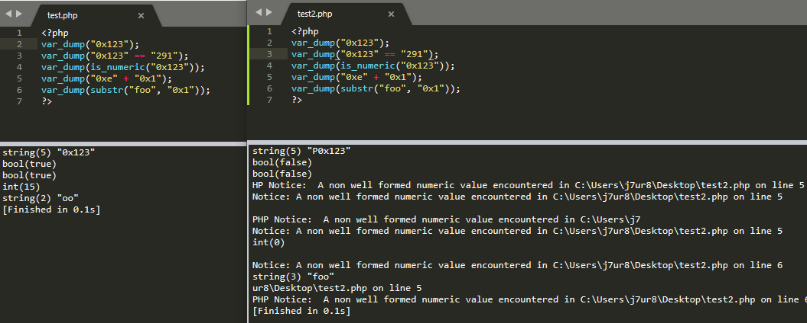

# 语法变更

## 变化的语法

### 关于变量处理的变化

PHP 7 现在使用了抽象语法树来解析源代码。这使得许多由于之前的PHP的解释器的限制所不可能实现的改进得以实现。 但出于一致性的原因导致了一些特殊例子的变动，而这些变动打破了向后兼容。 在这一章中将详细介绍这些例子。

#### 关于间接使用变量、属性和方法的变化

对变量、属性和方法的间接调用现在将严格遵循从左到右的顺序来解析，而不是之前的混杂着几个特殊案例的情况。 下面这张表说明了这个解析顺序的变化。

​										**间接调用的表达式的新旧解析顺序**

| 表达式                | PHP 5 的解析方式        | PHP 7 的解析方式        |
| :-------------------- | :---------------------- | :---------------------- |
| `$$foo['bar']['baz']` | `${$foo['bar']['baz']}` | `($$foo)['bar']['baz']` |
| `$foo->$bar['baz']`   | `$foo->{$bar['baz']}`   | `($foo->$bar)['baz']`   |
| `$foo->$bar['baz']()` | `$foo->{$bar['baz']}()` | `($foo->$bar)['baz']()` |
| `Foo::$bar['baz']()`  | `Foo::{$bar['baz']}()`  | `(Foo::$bar)['baz']()`  |

使用了旧的从右到左的解析顺序的代码必须被重写，明确的使用大括号来表明顺序（参见上表中间一列）。 这样使得代码既保持了与PHP 7.x的前向兼容性，又保持了与PHP 5.x的后向兼容性。

这同样影响了[**global**](https://www.php.net/manual/zh/language.variables.scope.php#language.variables.scope.global) 关键字。如果需要的话可以使用大括号来模拟之前的行为。

```php
<?php
function f() {
    // Valid in PHP 5 only.
    global $$foo->bar;

    // Valid in PHP 5 and 7.
    global ${$foo->bar};
}
?>
```

### 对Integer处理的变化

#### 8进制字符容错率降低   

在php5版本，如果一个八进制字符如果含有无效数字，该无效数字将被静默删节。但是在php7.0.0里面会触发一个解析错误。同样在php7.0.0以后被改回去。

```php
<?php
// 在php5和php7.0.0之外的版本测试结果应该如下
echo octdec( '012999999999999' ) . "\n";    // 10
echo octdec( '012' ) . "\n";                // 10
if (octdec( '012999999999999' )==octdec( '012' )){
        echo ": )". "\n";                   // : )
}
```

#### 负位移运算

以负数形式进行的位移运算将会抛出一个 **ArithmeticError**：

```php
<?php
var_dump(1 >> -1);
?>
```

结果

```
PHP5
int(0)

PHP7
Fatal error: Uncaught ArithmeticError: Bit shift by negative number in /tmp/test.php:2
Stack trace:
#0 {main}
  thrown in /tmp/test.php on line 2

```

#### 超范围后产生位移

超出 `integer`位宽的位移操作（无论哪个方向）将始终得到 0 作为结果。在从前，这一操作是结构依赖的

### string处理上的调整

#### 十六进制字符串规范

十六进制字符串不再被认为是数字

目前截至最新的PHP7.3版本依然没有改回去的征兆，官方称不会在改了。

```php
<?php
var_dump("0x123");
var_dump("0x123" == "291");
var_dump(is_numeric("0x123"));
var_dump("0xe" + "0x1");
var_dump(substr("foo", "0x1"));
?>
```

结果:

左边php5.6，右边php7.2




[filter_var()](https://www.php.net/manual/zh/function.filter-var.php) 函数可以用于检查一个 [string](https://www.php.net/manual/zh/language.types.string.php) 是否含有十六进制数字,并将其转换为[integer](https://www.php.net/manual/zh/language.types.integer.php):

```php
<?php
$str = "0xffff";
$int = filter_var($str, FILTER_VALIDATE_INT, FILTER_FLAG_ALLOW_HEX);
if (false === $int) {
    throw new Exception("Invalid integer!");
}
var_dump($int); // int(65535)
?>
```

由于新的 [Unicode codepoint escape syntax](https://www.php.net/manual/zh/migration70.new-features.php#migration70.new-features.unicode-codepoint-escape-syntax)语法， 紧连着无效序列并包含*\u{* 的字串可能引起致命错误。 为了避免这一报错，应该避免反斜杠开头。

### 移除了 ASP 和 script PHP 标签

使用类似 ASP 的标签，以及 script 标签来区分 PHP 代码的方式被移除。 受到影响的标签有：

| 开标签                    | 闭标签      |
| :------------------------ | :---------- |
| `<%`                      | `%>`        |
| `<%=`                     | `%>`        |
| `<script language="php">` | `</script>` |

### yield 变更为右联接运算符

在使用 `yield` 关键字的时候，不再需要括号， 并且它变更为右联接操作符，其运算符优先级介于 *print* 和 *=>* 之间。 这可能导致现有代码的行为发生改变：

```php
<?php
echo yield -1;
// 在之前版本中会被解释为：
echo (yield) - 1;
// 现在，它将被解释为：
echo yield (-1);

yield $foo or die;
// 在之前版本中会被解释为：
yield ($foo or die);
// 现在，它将被解释为：
(yield $foo) or die;
?>
```

可以通过使用括号来消除歧义。

### 关于对引用数组元素创建的变量的顺序变化

有如下代码

```php
<?php
$array = [];
$array["a"] =& $array["b"];
$array["b"] = 1;
var_dump($array);
?>
```

结果

```
PHP5
array(2) {
  ["b"]=>
  &int(1)
  ["a"]=>
  &int(1)
}

PHP7
array(2) {
  ["a"]=>
  &int(1)
  ["b"]=>
  &int(1)
}
```

### NULL合并运算符

由于日常使用中存在大量同时使用三元表达式和 `isset()`的情况， 我们添加了null合并运算符 (*??*) 这个语法糖。如果变量存在且值不为**NULL**， 它就会返回自身的值，否则返回它的第二个操作数。

```php
<?php
$sss=NULL;
$username=$sss ?? 'aaa';
echo $username."\n";

$sss= '';
$username=$sss ?? 'aaa';
echo $username."\n";

$username=$bbb ?? 'aaa';
echo $username."\n";

#结果
/*
aaa

aaa
*/
```

### 太空船操作符（组合比较符）

太空船操作符用于比较两个表达式。当$a小于、等于或大于$b时它分别返回-1、0或1。 比较的原则是沿用 PHP 的[**常规比较规则**](https://www.php.net/manual/zh/types.comparisons.php)进行的。

```php
<?php
// 整数
echo 1 <=> 1; // 0
echo 1 <=> 2; // -1
echo 2 <=> 1; // 1

// 浮点数
echo 1.5 <=> 1.5; // 0
echo 1.5 <=> 2.5; // -1
echo 2.5 <=> 1.5; // 1
 
// 字符串
echo "a" <=> "a"; // 0
echo "a" <=> "b"; // -1
echo "b" <=> "a"; // 1
?>
```

### 匿名类

现在支持通过*new class* 来实例化一个匿名类，这可以用来替代一些“用后即焚”的完整类定义。

```php
<?php
interface Logger {
    public function log(string $msg);
}

class Application {
    private $logger;

    public function getLogger(): Logger {
         return $this->logger;
    }

    public function setLogger(Logger $logger) {
         $this->logger = $logger;
    }
}

$app = new Application;
$app->setLogger(new class implements Logger {
    public function log(string $msg) {
        echo $msg;
    }
});

var_dump($app->getLogger());

#结果
/*
object(class@anonymous)#2 (0) {
}
*/
```

### Unicode codepoint 转译语法

这接受一个以16进制形式的 Unicode codepoint，并打印出一个双引号或heredoc包围的 UTF-8 编码格式的字符串。 可以接受任何有效的 codepoint，并且开头的 0 是可以省略的。

```php
<?php
echo "\u{aa}";
echo "\u{0000aa}";
echo "\u{9999}";
```

### 导入use声名组

从同一 `namespace` 导入的类、函数和常量现在可以通过单个 [*use*](https://www.php.net/manual/zh/language.namespaces.importing.php) 语句 一次性导入了。

```php
<?php

// PHP 7 之前的代码
use some\namespace\ClassA;
use some\namespace\ClassB;
use some\namespace\ClassC as C;

use function some\namespace\fn_a;
use function some\namespace\fn_b;
use function some\namespace\fn_c;

use const some\namespace\ConstA;
use const some\namespace\ConstB;
use const some\namespace\ConstC;

// PHP 7+ 及更高版本的代码
use some\namespace\{ClassA, ClassB, ClassC as C};
use function some\namespace\{fn_a, fn_b, fn_c};
use const some\namespace\{ConstA, ConstB, ConstC};
```

### 放宽了保留词限制

现在允许全局保留词用于类/接口/Trait 中的属性、常量和方法名。 在引入新关键词时，此变更减少了对向后兼容的破坏，避免了 API 命名的限制。

使用流畅的接口实现内部 DSL 时，这非常有用：

```php
<?php
// 以前不能用  'new'、'private' 和 'for'
Project::new('Project Name')->private()->for('purpose here')->with('username here');
?>
```

唯一的限制是： *class*关键词不能用于常量名，否则会和 类名解析语法冲突 (*ClassName::class*)。

## 弃用的语法

### PHP4 风格的构造函数

PHP4 风格的构造函数（方法名和类名一样）将被弃用，并在将来移除。 如果在类中仅使用了 PHP4 风格的构造函数，PHP7 会产生 **E_DEPRECATED** 警告。 如果还定义了 **__construct()** 方法则不受影响。

```php
<?php
class foo {
    function foo() {
        echo 'I am the constructor';
    }
}
?>
```


### 静态调用非静态的方法

废弃了**静态**调用未声明成 **static** 的方法，未来可能会彻底移除该功能。

```php
<?php
class foo {
    function bar() {
        echo 'I am not static!';
    }
}

foo::bar();
?>
```

## 参考

- https://www.php.net/manual/zh/migration70.incompatible.php
- http://xiaoze.club/