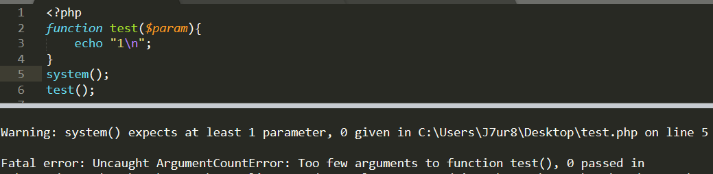

# PHP7.1语法相关的变更

## 新特性

### 短数组

短数组语法`[]`现在作为`list()`语法的一个备选项，可以用于将数组的值赋给一些变量（包括在*foreach*中）。

```php
<?php
$data = [
    [1, 'Tom'],
    [2, 'Fred'],
];

var_dump($data);

// list() style

list($id1, $name1) = $data[0];

// [] style
#[$id1, $name1] = $data[0];

// list() style
foreach ($data as list($id, $name)) {
	echo "$id $name\n";
    // logic here with $id and $name
}

// [] style
foreach ($data as [$id, $name]) {
    // logic here with $id and $name
}
```

### 支持为负的字符串偏移量

现在所有支持偏移量的[字符串操作函数](https://www.php.net/manual/zh/book.strings.php) 都支持接受负数作为偏移量，包括通过`[]`或`{}`操作[字符串下标](https://www.php.net/manual/zh/language.types.string.php#language.types.string.substr)。在这种情况下，一个负数的偏移量会被理解为一个从字符串结尾开始的偏移量。

```php
<?php
var_dump("abcdef"[-2]); // string (1) "e"
var_dump(strpos("aabbcc", "b", -3));  // int(3)
```

字符串也同样支持

```php
<?php
$string = 'bar';
echo "The last character of '$string' is '$string[-1]'.\n";

# 结果
/*
The last character of 'bar' is 'r'.
*/
```

### 当传递参数过少时将抛出错误

在过去如果我们调用一个用户定义的函数时，提供的参数不足，那么将会产生一个警告(warning)。 现在，这个警告被提升为一个错误异常(Error exception)，意味着PHP会中断执行。这个变更仅对用户定义的函数生效， 并不包含内置函数。例如：

```php
<?php
function test($param){
	echo "1\n";
}
system();
test();
```




## 变化的特性

### 引用数组元素创建元素的顺序更改

```
<?php
$array = [];
$array["a"] =& $array["b"];
$array["b"] = 1;
var_dump($array);

# 结果
/*
PHP7.0
array(2) {
  ["a"]=>
  &int(1)
  ["b"]=>
  &int(1)
}

PHP7.1
array(2) {
  ["b"]=>
  &int(1)
  ["a"]=>
  &int(1)
}
*/
```

### JSON编码和解码

解码一个空键值将会解析为一个空属性名，而之前会解析为`_empty_`

```php
<?php
var_dump(json_decode(json_encode(['' => 1])));

# 结果
/*
PHP<7.1
object(stdClass)#1 (1) {
  ["_empty_"]=>
  int(1)
}

PHP7.1
object(stdClass)#1 (1) {
  [""]=>
  int(1)
}
```

