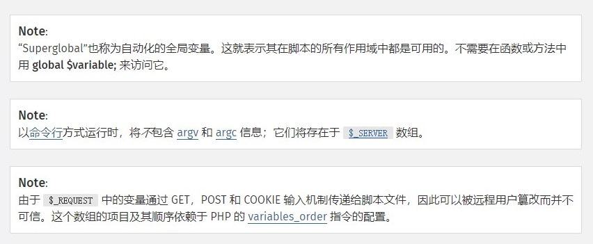
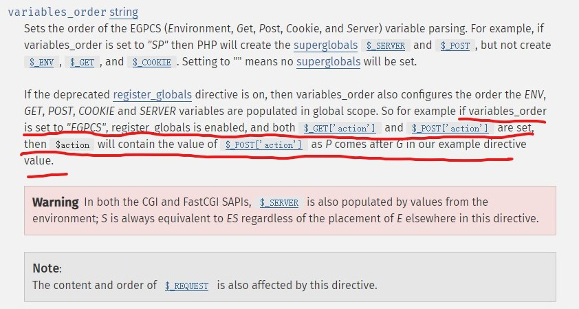
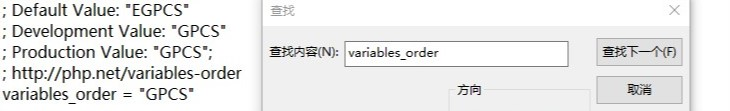

# 深入理解_REQUEST数组


## 利用条件

- waf处理的是REQUEST数组，然而数据处理的却是GET。
- (PHP 4 >= 4.1.0, PHP 5, PHP 7)

## 简介

### 手册注释



### variables_order


如画红线处，同一个变量名字，如果`variables_order`的顺序P在G后面，那么`$_POST['x']`会覆盖`$_GET['x']`的。

`variables_order`默认变量值为:


## 测试

demo.php

```php
<?php
print_r($_REQUEST['a']);
?>
```

burpsuite-repeater
```http
POST /?a=get HTTP/1.1
Host: 127.0.0.1
Content-Length: 6
Content-Type: application/x-www-form-urlencoded;charset=utf-8

a=post

//
Array
(
    [a] => post
)
```
```http
POST /?a=get HTTP/1.1
Host: 127.0.0.1
Content-Length: 0
Content-Type: application/x-www-form-urlencoded;charset=utf-8

//
Array
(
    [a] => get
)
```
