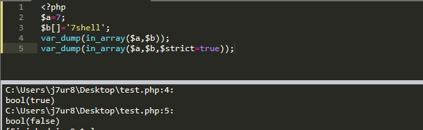

# in_array

## in_array

### 函数结构

```
in_array ( mixed $needle , array $haystack [, bool $strict = FALSE ] ) : bool
```

### 利用条件

- `$strict=FALSE`

### 测试代码

只要第三个参数`$strict`**没有**设置成**TRUE**，就不会进行强检查。

```php
<?php
$a=7;
$b[]='7shell';
var_dump(in_array($a,$b));
var_dump(in_array($a,$b,$strict=true));
```



