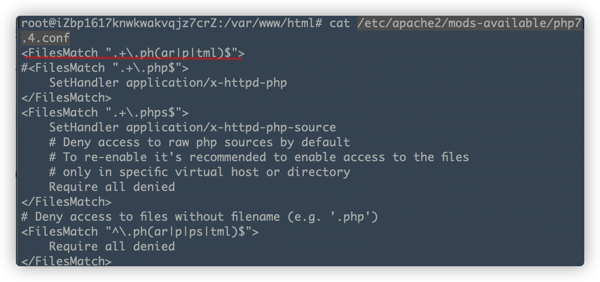

在一次出题目时，对文件上传进行黑名单过滤。测试一些后缀时，发现phtml后缀的文件被apache当作php文件解析了。

但是我是ubunt下一路apt默认安装的，所以为什么phtml会被解析呢？我没有配置任何文件。

进行了一番搜索，显示apache在

```
/etc/apache2/mods-available/php7.4.conf
```

文件中定义了会被当作php文件解析的后缀。

如图。

所以文件上传时，可以考虑利用`phar phtml`或`pht`后缀上传文件。
