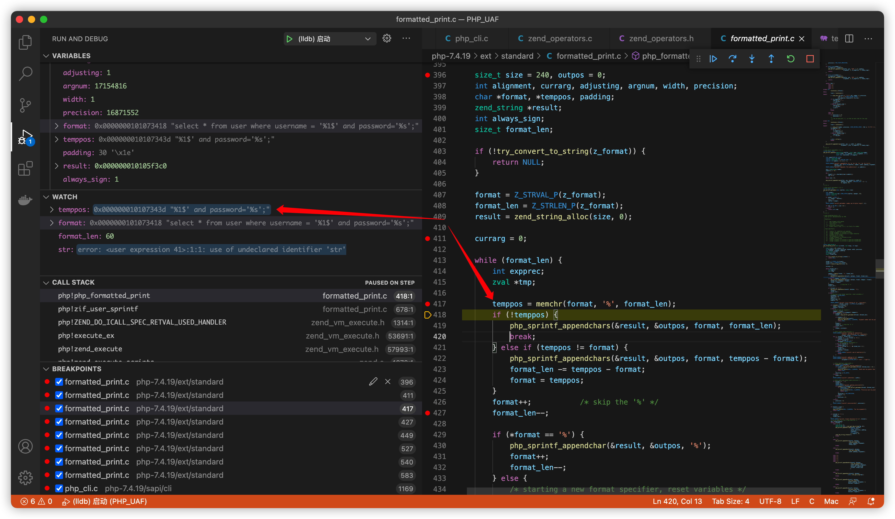
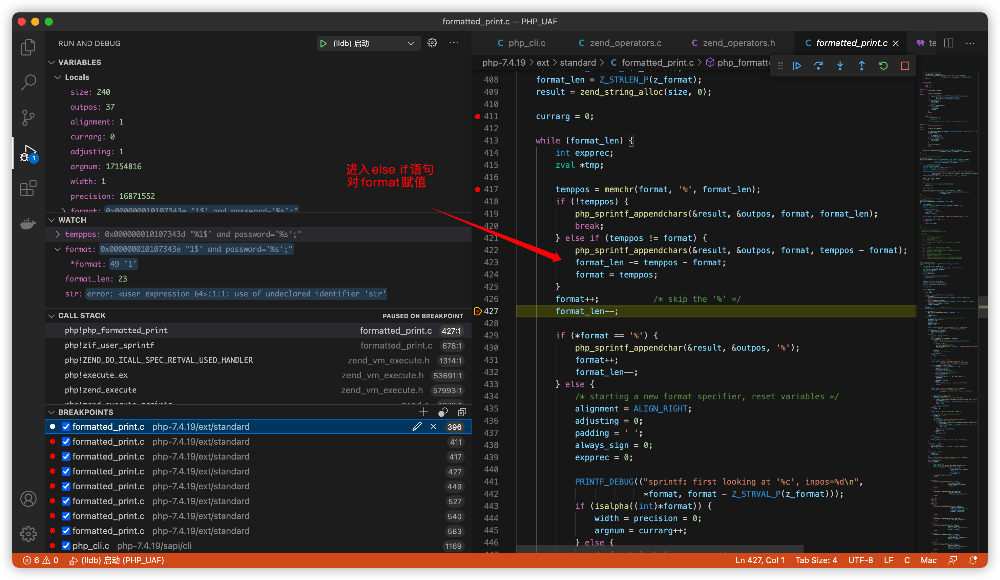
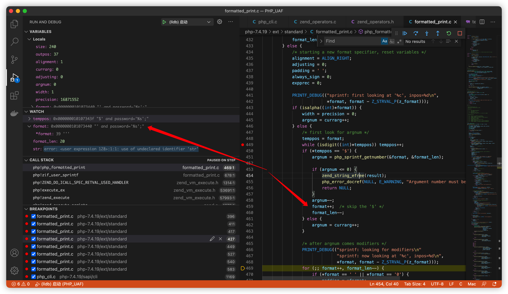
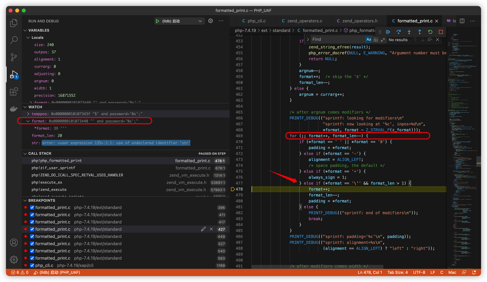
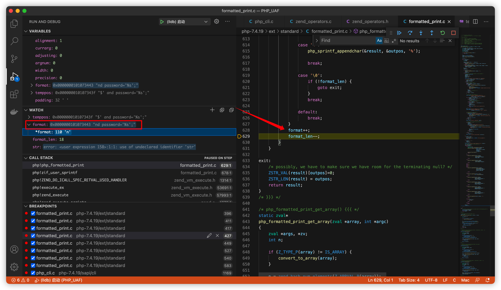
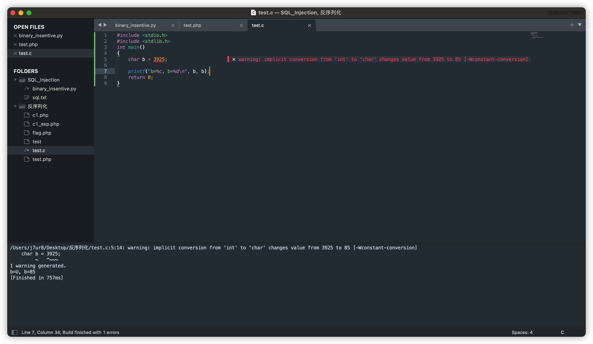

# sprintf格式化字符串漏洞

参考：

- https://blog.csdn.net/weixin_41185953/article/details/80485075
- https://blog.csdn.net/SopRomeo/article/details/105849403

测试demo：

```php
<?php
$sql = "select * from user where username = '%1$' and password='%s';";
$args = "3925" ;
echo  sprintf ($sql , $args) ;
/*
select * from user where username = 'nd password='3925';
*/
```

​		发现`' a`三个字符消失了，单引号被吞掉，导致存在sql注入风险。

## 分析

​		环境：VSCode+php7.4.19

​		在php_formatted_print函数处下断点，调用栈为：

```
php!php_formatted_print (/Users/j7ur8/Desktop/PHP_UAF/php-7.4.19/ext/standard/formatted_print.c:396)
php!zif_user_sprintf (/Users/j7ur8/Desktop/PHP_UAF/php-7.4.19/ext/standard/formatted_print.c:678)
.......
php!main (/Users/j7ur8/Desktop/PHP_UAF/php-7.4.19/sapi/cli/php_cli.c:1359)
libdyld.dylib!start (Unknown Source:0)
```

​		函数构造为：

```php
php_formatted_print(zval *z_format, zval *args, int argc)
{
	size_t size = 240, outpos = 0;
	int alignment, currarg, adjusting, argnum, width, precision;
	char *format, *temppos, padding;
	zend_string *result;
	int always_sign;
	size_t format_len;

	if (!try_convert_to_string(z_format)) {
		return NULL;
	}

	format = Z_STRVAL_P(z_format);
	format_len = Z_STRLEN_P(z_format);
	result = zend_string_alloc(size, 0);

	currarg = 0;

	while (format_len) {
		int expprec;
		zval *tmp;

		temppos = memchr(format, '%', format_len);
		if (!temppos) {
			php_sprintf_appendchars(&result, &outpos, format, format_len);
			break;
		} else if (temppos != format) {
			php_sprintf_appendchars(&result, &outpos, format, temppos - format);
			format_len -= temppos - format;
			format = temppos;
		}
		format++;			/* skip the '%' */
		format_len--;

		if (*format == '%') {
			php_sprintf_appendchar(&result, &outpos, '%');
			format++;
			format_len--;
		} else {
			/* starting a new format specifier, reset variables */
			alignment = ALIGN_RIGHT;
			adjusting = 0;
			padding = ' ';
			always_sign = 0;
			expprec = 0;

			PRINTF_DEBUG(("sprintf: first looking at '%c', inpos=%d\n",
						  *format, format - Z_STRVAL_P(z_format)));
			if (isalpha((int)*format)) {
				width = precision = 0;
				argnum = currarg++;
			} else {
				/* first look for argnum */
				temppos = format;
				while (isdigit((int)*temppos)) temppos++;
				if (*temppos == '$') {
					argnum = php_sprintf_getnumber(&format, &format_len);

					if (argnum <= 0) {
						zend_string_efree(result);
						php_error_docref(NULL, E_WARNING, "Argument number must be greater than zero");
						return NULL;
					}
					argnum--;
					format++;  /* skip the '$' */
					format_len--;
				} else {
					argnum = currarg++;
				}

				/* after argnum comes modifiers */
				PRINTF_DEBUG(("sprintf: looking for modifiers\n"
							  "sprintf: now looking at '%c', inpos=%d\n",
							  *format, format - Z_STRVAL_P(z_format)));
				for (;; format++, format_len--) {
					if (*format == ' ' || *format == '0') {
						padding = *format;
					} else if (*format == '-') {
						alignment = ALIGN_LEFT;
						/* space padding, the default */
					} else if (*format == '+') {
						always_sign = 1;
					} else if (*format == '\'' && format_len > 1) {
						format++;
						format_len--;
						padding = *format;
					} else {
						PRINTF_DEBUG(("sprintf: end of modifiers\n"));
						break;
					}
				}
				PRINTF_DEBUG(("sprintf: padding='%c'\n", padding));
				PRINTF_DEBUG(("sprintf: alignment=%s\n",
							  (alignment == ALIGN_LEFT) ? "left" : "right"));


				/* after modifiers comes width */
				if (isdigit((int)*format)) {
					PRINTF_DEBUG(("sprintf: getting width\n"));
					if ((width = php_sprintf_getnumber(&format, &format_len)) < 0) {
						efree(result);
						php_error_docref(NULL, E_WARNING, "Width must be greater than zero and less than %d", INT_MAX);
						return NULL;
					}
					adjusting |= ADJ_WIDTH;
				} else {
					width = 0;
				}
				PRINTF_DEBUG(("sprintf: width=%d\n", width));

				/* after width and argnum comes precision */
				if (*format == '.') {
					format++;
					format_len--;
					PRINTF_DEBUG(("sprintf: getting precision\n"));
					if (isdigit((int)*format)) {
						if ((precision = php_sprintf_getnumber(&format, &format_len)) < 0) {
							efree(result);
							php_error_docref(NULL, E_WARNING, "Precision must be greater than zero and less than %d", INT_MAX);
							return NULL;
						}
						adjusting |= ADJ_PRECISION;
						expprec = 1;
					} else {
						precision = 0;
					}
				} else {
					precision = 0;
				}
				PRINTF_DEBUG(("sprintf: precision=%d\n", precision));
			}

			if (argnum >= argc) {
				efree(result);
				php_error_docref(NULL, E_WARNING, "Too few arguments");
				return NULL;
			}

			if (*format == 'l') {
				format++;
				format_len--;
			}
			PRINTF_DEBUG(("sprintf: format character='%c'\n", *format));
			/* now we expect to find a type specifier */
			tmp = &args[argnum];
			switch (*format) {
				case 's': {
					zend_string *t;
					zend_string *str = zval_get_tmp_string(tmp, &t);
					php_sprintf_appendstring(&result, &outpos,
											 ZSTR_VAL(str),
											 width, precision, padding,
											 alignment,
											 ZSTR_LEN(str),
											 0, expprec, 0);
					zend_tmp_string_release(t);
					break;
				}

				case 'd':
					php_sprintf_appendint(&result, &outpos,
										  zval_get_long(tmp),
										  width, padding, alignment,
										  always_sign);
					break;

				case 'u':
					php_sprintf_appenduint(&result, &outpos,
										  zval_get_long(tmp),
										  width, padding, alignment);
					break;

				case 'g':
				case 'G':
				case 'e':
				case 'E':
				case 'f':
				case 'F':
					php_sprintf_appenddouble(&result, &outpos,
											 zval_get_double(tmp),
											 width, padding, alignment,
											 precision, adjusting,
											 *format, always_sign
											);
					break;

				case 'c':
					php_sprintf_appendchar(&result, &outpos,
										(char) zval_get_long(tmp));
					break;

				case 'o':
					php_sprintf_append2n(&result, &outpos,
										 zval_get_long(tmp),
										 width, padding, alignment, 3,
										 hexchars, expprec);
					break;

				case 'x':
					php_sprintf_append2n(&result, &outpos,
										 zval_get_long(tmp),
										 width, padding, alignment, 4,
										 hexchars, expprec);
					break;

				case 'X':
					php_sprintf_append2n(&result, &outpos,
										 zval_get_long(tmp),
										 width, padding, alignment, 4,
										 HEXCHARS, expprec);
					break;

				case 'b':
					php_sprintf_append2n(&result, &outpos,
										 zval_get_long(tmp),
										 width, padding, alignment, 1,
										 hexchars, expprec);
					break;

				case '%':
					php_sprintf_appendchar(&result, &outpos, '%');

					break;

				case '\0':
					if (!format_len) {
						goto exit;
					}
					break;

				default:
					break;
			}
			format++;
			format_len--;
		}
	}
```

​		函数使用`while (format_len)`语句循环对字符串以%`出现的位置进行截取，然后进行格式化处理。

​		进入断点后，对tempos、format和format_len函数添加WATCH。可以看到在第一次while循环中，417行memchr函数对format进行了第一次截取得到字符串：
`%1$' and password='%s';`



​		进入else if判断，对format进行复制后，忽略字符%。可以看到左侧format与tempos变量对比少了一个字符`%`。（在429行进一步判断是否存在字符`%`，有则返回返回字符`%`；否则继续执行。429行的判断正是`%%`返回`%`的判断逻辑。这里不存在`%`，进入434行else判断。）



​		443行进行isalpha判断，失败，进入isdigit判断，对tempos赋值，判断首字母是否为数字，是数字则抛弃。得到字符串：`$' and password='%s';`。

​		450-463判断符号`$`是否存在，存在则抛弃format变量中的`$`。这里存在，抛弃，得到字符串：`' and password='%s';`。



​		469-485判断字符中是否存在字符`- +'`，存在则抛弃。这里存在，抛弃，得到字符串：`and password='%s';`。

​		为啥抛弃了两个字符` `和`'`呢，因为else if判断执行了一次`format++`后，for循环也执行了一次`format++`。



​		之后进入540行，由于不存在对应于字符`a`的规则，直接抛弃字符`a`，得到字符串：`nd password='%s'`。

​		然后进入下一次while循环处理`%s`。（此处不再分析）



**额外内容**

​		在533-536存在对字符`l`的判断，允许我们逃逸单引号的情况下保持字符串完整。

```php
			if (*format == 'l') {
				format++;
				format_len--;
			}
```

​		测试demo

```php
<?php
$sql = "select * from user where username = '%1\$l' and password='%s';";
$args = "3925" ;
echo  sprintf ($sql , $args) ;
/*
select * from user where username = ' and password='3925';
*/
```

## 利用方法

​		主要利用来逃逸单引号及利用字符`c`逃逸单个ascii字符。

### 逃逸单引号

```php
<?php
$sql = "select * from user where username = '%1$' and password='%s';";
$args = "3925" ;
echo  sprintf ($sql , $args) ;
/*
select * from user where username = 'nd password='3925';
*/
```

### 逃逸ascii字符

```php
<?php
$sql = "select * from user where username = '%1\$c' and password='%s';";
$args = "3925" ;
echo  sprintf ($sql , $args) ;
```

​		这里格式化3925的结果为85(U)的原因如下图：

