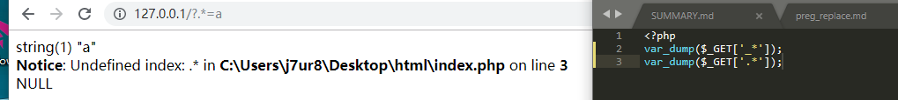

# URL非法键值替换

## 参考

- https://xz.aliyun.com/t/2557#toc-3

## 测试

有`http://127.0.0.1?.*=abc`，后台代码为：
```php
<?php
var_dump($_GET['_*']);
var_dump($_GET['.*']);
```
结果如图：

发现`.*`被替换成了`_*`。

这是由于在PHP中，对于传入的非法的`$_GET`数组参数名，会将其转换成下划线。

## 结论

可以fuzz下有哪些字符会被替换成下划线。

```python
import requests

for i in range(0,256):
	url='http://127.0.0.1/index.php?aaa'+chr(i)+'aaa=1'
	r=requests.get(url)
	if '_' in r.content:
		print str(i)+': '+chr(i)

'''
32:  
43: +
46: .
91: [
95: _  # 这个不算。
'''


for i in range(0,256):
	url='http://127.0.0.1/index.php?'+chr(i)+'aaa=1'
	r=requests.get(url)
	if '_' in r.content:
		print str(i)+': '+chr(i)

'''
46: .
95: _  # 这个不算
'''

import requests

for i in range(0,256):
	url='http://127.0.0.1/index.php?aaa'+chr(i)+'=1'
	r=requests.get(url)
	if b'_' in r.content:
		print( str(i)+': '+chr(i))

'''
32:  
43: +
46: .
91: [
95: _  # 这个不算
'''


import requests

for i in range(0,256):
	url='http://127.0.0.1/index.php?'+chr(i)+'=1'
	r=requests.get(url)
	if b'_' in r.content:
		print( str(i)+': '+chr(i))


'''
46: .
95: _  # 这个不算
'''
```

非法字符开头或者只有一个非法字符的情况，会被转换成`_`的有：`.`。
非法字符在中间，或者非法字符结尾的情况，会被转换成`_`的有：`.`、`空格`、`+`、`[`。

值得一提的是，如果只有一个空格或者空格开头的字符串作为键值，那么空格在url中会被转换成(%20)，并且`$_GET`不会取到空格
