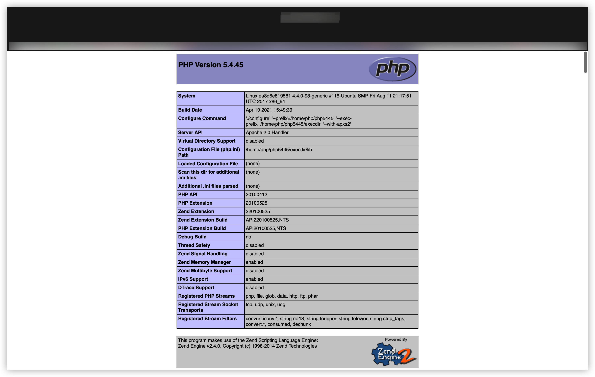
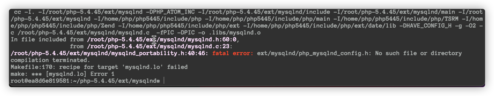
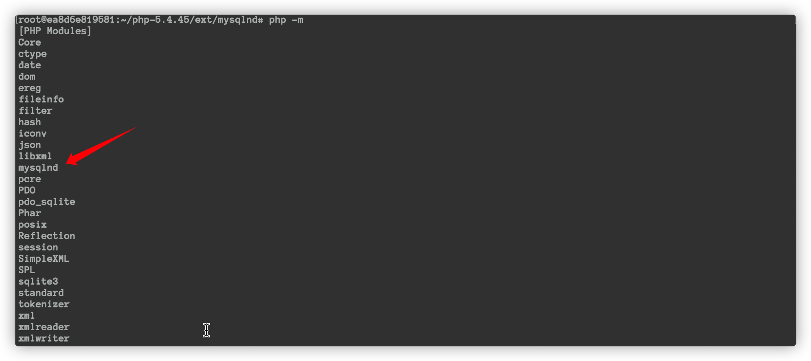
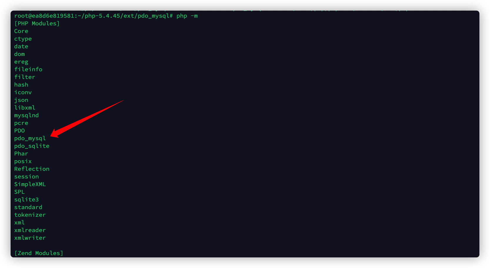
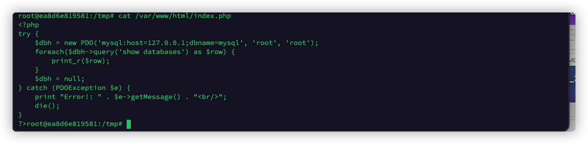
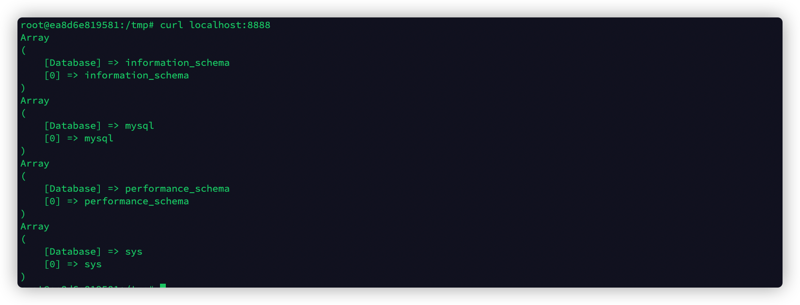

# 前言

复现一个漏洞，需要 php5.4 的 lamp 环境，但网上没有找到很好的环境，所以自己搭建了一个。

# 编译安装PHP

## 前置环境配置

```bash
# 安装docker
apt-get install docker.io
# pull ubuntu:16.04
docker pull ubuntu:16.04
# 启动容器
docker run -it -p8888:8888 ubuntu:16.04 /bin/bash
#更换源
mv /etc/apt/sources.list /etc/apt/sources.list.bak
echo "IyMgTm90ZSwgdGhpcyBmaWxlIGlzIHdyaXR0ZW4gYnkgY2xvdWQtaW5pdCBvbiBmaXJzdCBib290IG9mIGFuIGluc3RhbmNlDQojIyBtb2RpZmljYXRpb25zIG1hZGUgaGVyZSB3aWxsIG5vdCBzdXJ2aXZlIGEgcmUtYnVuZGxlLg0KIyMgaWYgeW91IHdpc2ggdG8gbWFrZSBjaGFuZ2VzIHlvdSBjYW46DQojIyBhLikgYWRkICdhcHRfcHJlc2VydmVfc291cmNlc19saXN0OiB0cnVlJyB0byAvZXRjL2Nsb3VkL2Nsb3VkLmNmZw0KIyMgICAgIG9yIGRvIHRoZSBzYW1lIGluIHVzZXItZGF0YQ0KIyMgYi4pIGFkZCBzb3VyY2VzIGluIC9ldGMvYXB0L3NvdXJjZXMubGlzdC5kDQojIyBjLikgbWFrZSBjaGFuZ2VzIHRvIHRlbXBsYXRlIGZpbGUgL2V0Yy9jbG91ZC90ZW1wbGF0ZXMvc291cmNlcy5saXN0LnRtcGwNCg0KIyBTZWUgaHR0cDovL2hlbHAudWJ1bnR1LmNvbS9jb21tdW5pdHkvVXBncmFkZU5vdGVzIGZvciBob3cgdG8gdXBncmFkZSB0bw0KIyBuZXdlciB2ZXJzaW9ucyBvZiB0aGUgZGlzdHJpYnV0aW9uLg0KZGViIGh0dHA6Ly9taXJyb3JzLmNsb3VkLmFsaXl1bmNzLmNvbS91YnVudHUvIHhlbmlhbCBtYWluDQpkZWItc3JjIGh0dHA6Ly9taXJyb3JzLmNsb3VkLmFsaXl1bmNzLmNvbS91YnVudHUvIHhlbmlhbCBtYWluDQoNCiMjIE1ham9yIGJ1ZyBmaXggdXBkYXRlcyBwcm9kdWNlZCBhZnRlciB0aGUgZmluYWwgcmVsZWFzZSBvZiB0aGUNCiMjIGRpc3RyaWJ1dGlvbi4NCmRlYiBodHRwOi8vbWlycm9ycy5jbG91ZC5hbGl5dW5jcy5jb20vdWJ1bnR1LyB4ZW5pYWwtdXBkYXRlcyBtYWluDQpkZWItc3JjIGh0dHA6Ly9taXJyb3JzLmNsb3VkLmFsaXl1bmNzLmNvbS91YnVudHUvIHhlbmlhbC11cGRhdGVzIG1haW4NCg0KIyMgTi5CLiBzb2Z0d2FyZSBmcm9tIHRoaXMgcmVwb3NpdG9yeSBpcyBFTlRJUkVMWSBVTlNVUFBPUlRFRCBieSB0aGUgVWJ1bnR1DQojIyB0ZWFtLiBBbHNvLCBwbGVhc2Ugbm90ZSB0aGF0IHNvZnR3YXJlIGluIHVuaXZlcnNlIFdJTEwgTk9UIHJlY2VpdmUgYW55DQojIyByZXZpZXcgb3IgdXBkYXRlcyBmcm9tIHRoZSBVYnVudHUgc2VjdXJpdHkgdGVhbS4NCmRlYiBodHRwOi8vbWlycm9ycy5jbG91ZC5hbGl5dW5jcy5jb20vdWJ1bnR1LyB4ZW5pYWwgdW5pdmVyc2UNCmRlYi1zcmMgaHR0cDovL21pcnJvcnMuY2xvdWQuYWxpeXVuY3MuY29tL3VidW50dS8geGVuaWFsIHVuaXZlcnNlDQpkZWIgaHR0cDovL21pcnJvcnMuY2xvdWQuYWxpeXVuY3MuY29tL3VidW50dS8geGVuaWFsLXVwZGF0ZXMgdW5pdmVyc2UNCmRlYi1zcmMgaHR0cDovL21pcnJvcnMuY2xvdWQuYWxpeXVuY3MuY29tL3VidW50dS8geGVuaWFsLXVwZGF0ZXMgdW5pdmVyc2UNCg0KIyMgTi5CLiBzb2Z0d2FyZSBmcm9tIHRoaXMgcmVwb3NpdG9yeSBpcyBFTlRJUkVMWSBVTlNVUFBPUlRFRCBieSB0aGUgVWJ1bnR1IA0KIyMgdGVhbSwgYW5kIG1heSBub3QgYmUgdW5kZXIgYSBmcmVlIGxpY2VuY2UuIFBsZWFzZSBzYXRpc2Z5IHlvdXJzZWxmIGFzIHRvDQojIyB5b3VyIHJpZ2h0cyB0byB1c2UgdGhlIHNvZnR3YXJlLiBBbHNvLCBwbGVhc2Ugbm90ZSB0aGF0IHNvZnR3YXJlIGluIA0KIyMgbXVsdGl2ZXJzZSBXSUxMIE5PVCByZWNlaXZlIGFueSByZXZpZXcgb3IgdXBkYXRlcyBmcm9tIHRoZSBVYnVudHUNCiMjIHNlY3VyaXR5IHRlYW0uDQojIGRlYiBodHRwOi8vbWlycm9ycy5jbG91ZC5hbGl5dW5jcy5jb20vdWJ1bnR1LyB4ZW5pYWwgbXVsdGl2ZXJzZQ0KIyBkZWItc3JjIGh0dHA6Ly9taXJyb3JzLmNsb3VkLmFsaXl1bmNzLmNvbS91YnVudHUvIHhlbmlhbCBtdWx0aXZlcnNlDQojIGRlYiBodHRwOi8vbWlycm9ycy5jbG91ZC5hbGl5dW5jcy5jb20vdWJ1bnR1LyB4ZW5pYWwtdXBkYXRlcyBtdWx0aXZlcnNlDQojIGRlYi1zcmMgaHR0cDovL21pcnJvcnMuY2xvdWQuYWxpeXVuY3MuY29tL3VidW50dS8geGVuaWFsLXVwZGF0ZXMgbXVsdGl2ZXJzZQ0KDQojIyBVbmNvbW1lbnQgdGhlIGZvbGxvd2luZyB0d28gbGluZXMgdG8gYWRkIHNvZnR3YXJlIGZyb20gdGhlICdiYWNrcG9ydHMnDQojIyByZXBvc2l0b3J5Lg0KIyMgTi5CLiBzb2Z0d2FyZSBmcm9tIHRoaXMgcmVwb3NpdG9yeSBtYXkgbm90IGhhdmUgYmVlbiB0ZXN0ZWQgYXMNCiMjIGV4dGVuc2l2ZWx5IGFzIHRoYXQgY29udGFpbmVkIGluIHRoZSBtYWluIHJlbGVhc2UsIGFsdGhvdWdoIGl0IGluY2x1ZGVzDQojIyBuZXdlciB2ZXJzaW9ucyBvZiBzb21lIGFwcGxpY2F0aW9ucyB3aGljaCBtYXkgcHJvdmlkZSB1c2VmdWwgZmVhdHVyZXMuDQojIyBBbHNvLCBwbGVhc2Ugbm90ZSB0aGF0IHNvZnR3YXJlIGluIGJhY2twb3J0cyBXSUxMIE5PVCByZWNlaXZlIGFueSByZXZpZXcNCiMjIG9yIHVwZGF0ZXMgZnJvbSB0aGUgVWJ1bnR1IHNlY3VyaXR5IHRlYW0uDQojIGRlYiBodHRwOi8vbWlycm9ycy5jbG91ZC5hbGl5dW5jcy5jb20vdWJ1bnR1LyB4ZW5pYWwtYmFja3BvcnRzIG1haW4gcmVzdHJpY3RlZCB1bml2ZXJzZSBtdWx0aXZlcnNlDQojIGRlYi1zcmMgaHR0cDovL21pcnJvcnMuY2xvdWQuYWxpeXVuY3MuY29tL3VidW50dS8geGVuaWFsLWJhY2twb3J0cyBtYWluIHJlc3RyaWN0ZWQgdW5pdmVyc2UgbXVsdGl2ZXJzZQ0KDQojIyBVbmNvbW1lbnQgdGhlIGZvbGxvd2luZyB0d28gbGluZXMgdG8gYWRkIHNvZnR3YXJlIGZyb20gQ2Fub25pY2FsJ3MNCiMjICdwYXJ0bmVyJyByZXBvc2l0b3J5Lg0KIyMgVGhpcyBzb2Z0d2FyZSBpcyBub3QgcGFydCBvZiBVYnVudHUsIGJ1dCBpcyBvZmZlcmVkIGJ5IENhbm9uaWNhbCBhbmQgdGhlDQojIyByZXNwZWN0aXZlIHZlbmRvcnMgYXMgYSBzZXJ2aWNlIHRvIFVidW50dSB1c2Vycy4NCiMgZGViIGh0dHA6Ly9hcmNoaXZlLmNhbm9uaWNhbC5jb20vdWJ1bnR1IHhlbmlhbCBwYXJ0bmVyDQojIGRlYi1zcmMgaHR0cDovL2FyY2hpdmUuY2Fub25pY2FsLmNvbS91YnVudHUgeGVuaWFsIHBhcnRuZXINCg0KZGViIGh0dHA6Ly9taXJyb3JzLmNsb3VkLmFsaXl1bmNzLmNvbS91YnVudHUvIHhlbmlhbC1zZWN1cml0eSBtYWluDQpkZWItc3JjIGh0dHA6Ly9taXJyb3JzLmNsb3VkLmFsaXl1bmNzLmNvbS91YnVudHUvIHhlbmlhbC1zZWN1cml0eSBtYWluDQpkZWIgaHR0cDovL21pcnJvcnMuY2xvdWQuYWxpeXVuY3MuY29tL3VidW50dS8geGVuaWFsLXNlY3VyaXR5IHVuaXZlcnNlDQpkZWItc3JjIGh0dHA6Ly9taXJyb3JzLmNsb3VkLmFsaXl1bmNzLmNvbS91YnVudHUvIHhlbmlhbC1zZWN1cml0eSB1bml2ZXJzZQ0KIyBkZWIgaHR0cDovL21pcnJvcnMuY2xvdWQuYWxpeXVuY3MuY29tL3VidW50dS8geGVuaWFsLXNlY3VyaXR5IG11bHRpdmVyc2UNCiMgZGViLXNyYyBodHRwOi8vbWlycm9ycy5jbG91ZC5hbGl5dW5jcy5jb20vdWJ1bnR1LyB4ZW5pYWwtc2VjdXJpdHkgbXVsdGl2ZXJzZQ=="|base64 -d > /etc/apt/sources.list

# 安装必要环境
apt-get install vim wget net-tools curl

# 安装编译php需要的环境 eg:https://github.com/php/php-src#building-php-source-code
# 安装apache2-dev是因为php只能在编译时载入apache模块，所以我们需要--with-apxs2参数
apt install -y pkg-config build-essential autoconf bison re2c libxml2-dev libsqlite3-dev apache2 apache2-dev
```

## 下载并编译安装php

```bash
#下载解压php-5.4.45 eg: https://www.php.net/releases/
cd /root
wget https://www.php.net/distributions/php-5.4.45.tar.bz2
tar jxvf php-5.4.45.tar.bz2

# 编译php-5.4.45  参数可通过 ./configure -h 查看
cd php-5.4.45
./buildconf --force
./configure --prefix=/home/php/php5445 --exec-prefix=/home/php/php5445/execdir --with-apxs2
make
make install
# 下面这个命令是make install 后提示的命令，不知道具体是什么作用
/usr/share/apr-1.0/build/libtool --finish /root/php-5.4.45/libs
# 创建 php.ini 文件
mv /root/php-5.4.45/php.ini-development /home/php/php5445/execdir/lib/php.ini
# 配置环境变了
export PATH="/home/php/php5445/execdir/bin/:$PATH" >> ~/.bashrc
# 刷新环境
source ~/.bashrc
```

- 安装目录在 `/home/php/php5445`
- 执行文件目录在 `/home/php/php5445/execdir/bin`

由于我们并没有附带任何其他参数，执行的是 PHP 的默认安装，所以只安装了如下模块：

```bash
Core ctype date dom ereg fileinfo filter hash iconv json libxml pcre PDO pdo_sqlite Phar posix Reflection session SimpleXML SPL sqlite3 standard tokenizer xml xmlreader xmlwriter
```

3. 我们使用默认配置编译php，如果需要安装其他扩展，可能需要如下库。（下文我们会示例介绍如何编译安装mysql扩展）

## 如何编译其他模块

对于日常可能用的模块，我们需要先下载如下库

```bash
apt-get install zlib1g-dev libbz2-dev libcurl4-openssl-dev openssl libssl-dev libpng-dev libjpeg-dev libmcrypt-dev libedit-dev libreadline-dev libmysqlclient-dev
```

- `libedit-dev libreadline-dev` 是 `php -a` 也就是 php 交互模式需要的库 (readline 模块)

我会在下文示例编译安装 pdo_mysql 库，其他库的安装大同小异。

# 配合apache2

## 配置环境

```bash
# 更换监听端口
sed -i 's|Listen 80|Listen 8888|' /etc/apache2/ports.conf
#设置php文件处理模块
echo 'U2VydmVyTmFtZSBsb2NhbGhvc3QKCjxGaWxlc01hdGNoIFwucGhwJD4KICAgIFNldEhhbmRsZXIgYXBwbGljYXRpb24veC1odHRwZC1waHAKPC9GaWxlc01hdGNoPg==' | base64 -d >> /etc/apache2/apache2.conf

# 因为我们编译的php是线程不安全型，所以需要设置一下apache
a2dismod mpm_event
a2enmod mpm_prefork

#重启apache2
service apache2 restart
```

访问 `http://ip:8888`  成功运行

# 配合Mysql

## 安装 `mysql5.7`

```
apt-get install mysql-client-5.7 mysql-server-5.7 -y
# 输入密码
```

## 编译安装 `mysqlnd` 扩展（必须先安装它）

如下命令：

```bash
# 进入mysql的ext目录
cd /root/php-5.4.45/ext/mysqlnd
mv config9.m4 config.m4
phpize
./configure --with-php-config=$(which php-config)
# 执行 make 命令会出现报错，看下文即可解决，解决后再继续执行如下命令
make
```

> 上述报错如下:
>
> 
>
> 执行下列命令即可解决
>
> ```bash
> # 更换php_mysqlnd_config.h为 config.h
> sed -i 's|ext/mysqlnd/php_mysqlnd_config.h|ext/mysqlnd/config.h|' /root/php-5.4.45/ext/mysqlnd/mysqlnd_portability.h
> # 更换相对路径为绝对路径
> sed -i 's|ext/mysqlnd|/root/php-5.4.45/ext/mysqlnd|' /root/php-5.4.45/ext/mysqlnd/mysqlnd_portabilit.h
> 
> ```


```bash
# 继续执行命令makemake install# 更改 /home/php/php5445/execdir/lib/php.ini 配置echo extension=mysqlnd.so >> /home/php/php5445/execdir/lib/php.ini
```

执行 `php -a` 可看到成功加载

## 编译安装 `pdo_msyql` 扩展

执行下列命令

```bash
# 进入 pdo_mysql 源文件夹cd /root/php-5.4.45/ext/pdo_mysql/phpize./configure --with-php-config=$(which php-config) --with-pdo-mysqlmakemake installecho "extension=pdo_mysql.so" >> /home/php/php5445/execdir/lib/php.ini
```

查看php安装的模块 `php -m` ，成功安装 pdo_mysql 扩展 

## 测试环境

1. 启动环境

```
# 启动 mysqlservice mysql restart# 启动 apacheservice apache2 restart
```

2. 更改 index.php 代码

```
echo "PD9waHANCnRyeSB7DQogICAgJGRiaCA9IG5ldyBQRE8oJ215c3FsOmhvc3Q9MTI3LjAuMC4xO2RibmFtZT1teXNxbCcsICdyb290JywgJ3Jvb3QnKTsNCiAgICBmb3JlYWNoKCRkYmgtPnF1ZXJ5KCdzaG93IGRhdGFiYXNlcycpIGFzICRyb3cpIHsNCiAgICAgICAgcHJpbnRfcigkcm93KTsNCiAgICB9DQogICAgJGRiaCA9IG51bGw7DQp9IGNhdGNoIChQRE9FeGNlcHRpb24gJGUpIHsNCiAgICBwcmludCAiRXJyb3IhOiAiIC4gJGUtPmdldE1lc3NhZ2UoKSAuICI8YnIvPiI7DQogICAgZGllKCk7DQp9DQo/Pg==" |base64 -d > /var/www/html/index.php
```



访问 `curl localhost:8888`



环境配置成功。

# 后记

其他版本的 php 环境搭建大同小异。

如果文章有错误，还请师傅们指点；有粗些掠过的细节，欢迎留言。
