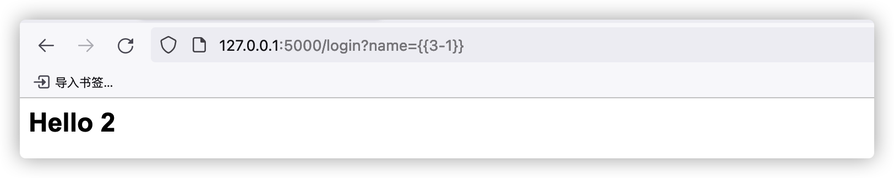
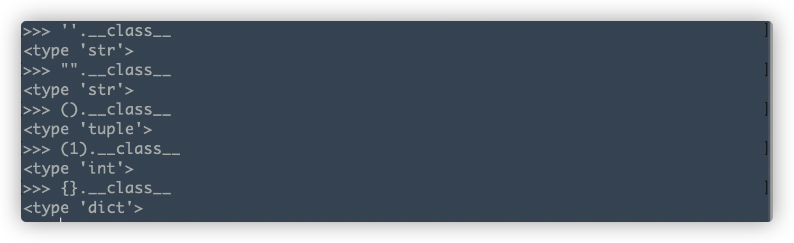
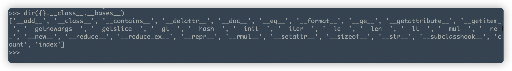

# Flask Jinja2 SSTI

SSTI的目的：

- CTF中获取flag，执行命令。
- 实际生产环境，GetShell。

python2-3中，五个标准数据类型都可通过魔术方法和内部方法等方式层层嵌套逃逸沙箱获取其他类或方法，进而执行命令或读取文件。这也就是SSTI的经典所在。

## 0x01触发点

web.py

```python
from flask import Flask
from flask import request, render_template_string
app = Flask(__name__)
@app.route('/login')
def hello_ssti():
    person = {
        'name': 'hello',
        'secret': 'This_is_my_secret'
    }
    if request.args.get('name'):
        person['name'] = request.args.get('name')
    template = '<h2>Hello {}</h2>'.format(person['name'])
    return render_template_string(template)
    
if __name__ == "__main__":
    app.run(debug=True)
```

如图，输入`{{3-1}}`返回2。存在ssti漏洞。

但是如何利用呢？ 在`{{}}`中我们可以通过如下方法：调用python内置的一些方法和函数，但是这远远不够，所以这就涉及到了ssti沙箱逃逸的姿势。

由于我们只能使用x.y这样利用`.`获取x的上一层或下一层的内容，所以我们可以先层层向上获取顶层Object对象，然后再通过遍历Object获取想要的方法并执行。

## 五个标准数据类型

五个标准数据类型是我们获取顶层Object对象的起点。如下

```python
''.__class__
"".__class__
().__class__
(1).__class__
{}.__class__
(123-12j).__class__  #复数
(1111111111111111111111111111).__class__ #long
(1.1).__class__ #浮点数
```

`<type 'int'>`与复数、long、浮点数同属于Numbers类型。

## 魔术方法

魔术方法是我们获取顶层Object对象不可缺少的方法，且每个变量下都存在魔术方法，可通过dir函数查看

常见的魔术方法有如下：

1. `__class__` 返回调用的类型
2. `__mro__` 查看类继承的所有父类，直到object
3. `__subclasses__` 获取类的所有子类
4. `__bases__` 获取所有直接父类所组成的元组
5. `__init__` 类实例创建之后调用, 对当前对象的实例的一些初始化
6. `__globals__` 能够返回函数所在模块命名空间的所有变量
7. `__import__` 引入包


懒得写下去了= =整理好困难，后面补坑。

# 参考


- https://segmentfault.com/a/1190000007256392
- https://misakikata.github.io/2020/04/python-沙箱逃逸与SSTI/#SSTI
- https://www.cnblogs.com/zaqzzz/p/10263396.html

